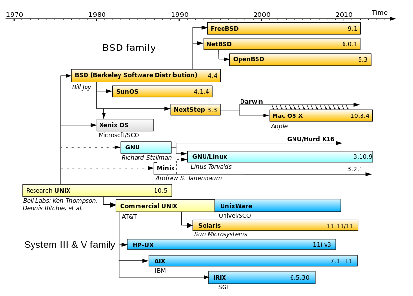
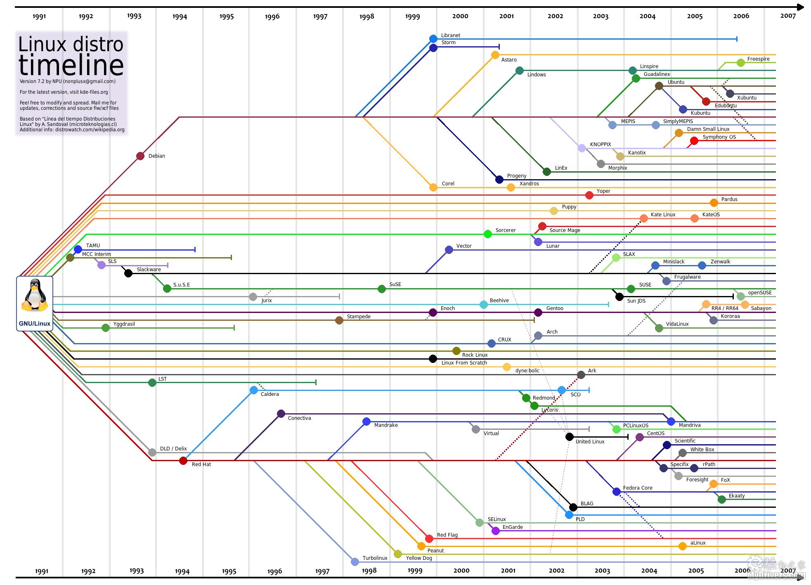
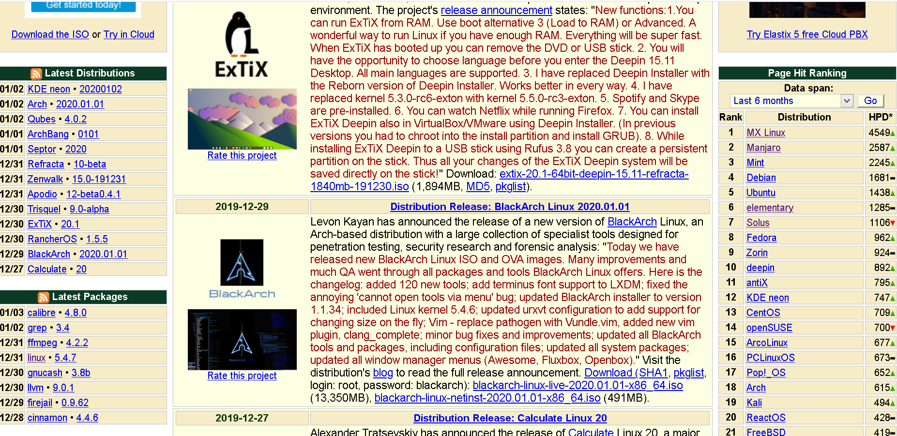
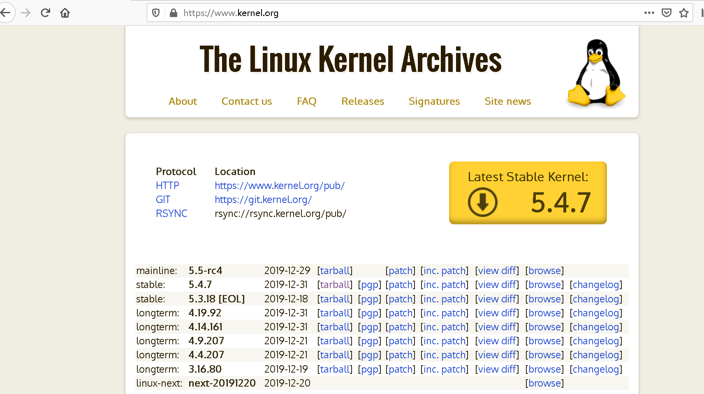
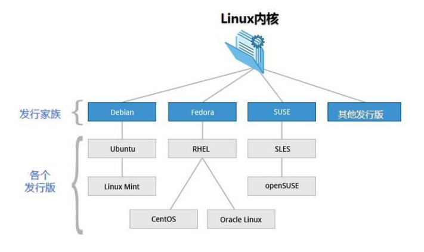

# 1.1 Linux简介

**教学目的**

使学生了解Unix的发展历史，了解Linux的发展历史，了解Linux发行版谱系和Linux桌面环境。

**知识点**

1.	Unix的历史
2.	Linux的发展历史
3.	Linux操作系统基础知识

**难点**

1.	理解Unix和Linux的发展历史
2.	熟悉Linux相关组织、术语等
3.	掌握Linux操作系统基础知识

本讲我们介绍Linux的发展历史。内容包括了Unix的历史、Linux的发展历史、Linux的发行版谱系和Linux的桌面环境。

## 1. Unix的发展历史

**1964年贝尔实验室、麻省理工学院及通用电气公司所共同参与研发出了一个分时操作系统**，Multics，开发该系统的目的是为了开发出一套安装在大型主机上多人多工的操作系统。尽管这个操作系统各种特性很吸引人，但是开发进度非常缓慢，**贝尔实验室的两位软件工程师Thompson和Ritchie**对`Multics`的开发进度非常不满，开始开发Unix，"UNiplexed Information and Computing Service"。**Dennis Ritchie**发现汇编语言开发进度很慢，开发出了B语言，后又在B语言的基础上**发明了C语言，C语言加速了UNIX操作系统的开发速度**。Dennis Ritchie在2011.10去世，Ritchie有一个设计原则KISS，Keep It Simple Stupid，简洁至上。


Unix发展迅速，1975年Unix第6版引入了多道技术，成为真正的多用户分时系统。1980年，贝尔实验室公布了32位操作系统，Unix32V。在Unix32V的基础上，Unix走上了AT&T贝尔实验室和加州大学伯克利分校两条发展道路。1980年，伯克利先后公布了Unix BSD 4.0和Unix BSD 4.1；1983年公布了Unix BSD 4.2。AT&T在1982、1983年发布了Unix system III和Unix system V，**到现在还是很清晰的两条路，System和BSD。**

SystemV和BSD的区别

|                    | Sytem V     | BSD       |
| ------------------ | ----------- | --------- |
| Root脚本位置       | /etc/init.d | /etc/rc.d |
| 默认Shell          | Bshell      | Cshell    |
| 文件系统数据       | /etc/mnttab | /etc/mtab |
| 内核位置           | /UNIX       | /vmUnix   |
| 打印机设备         | lp          | rlp       |
| 字符串函数         | memcopy     | bcopy     |
| 终端初始化设置文件 | /etc/initab | /etc/ttys |
| 终端控制           | termio      | termios   |

**Unix系统分叉**发展导致了Unix系统在系统调用、库函数、基本命令方面的区别。应用程序的网络编程接口
**BSD**系统使用socket，使应用程序可以再网络中相互通信；**System V**提供了与socket完全不兼容的传输层接口TLI。ps命令，该命令允许用户查询操作系统中进程的信息。BSD系统中，`ps -aux`可以列出机器中所有正在运行的进程；System V中，`ps -aux`是无效的，取而代之的是`ps -ef`。

练习1.   试一试`ps –aux`和`ps –ef`命令的区别。

（1）打开终端

（2）输入`ps –aux`

（3）输入`ps -ef`

BSD和System V中root自启动脚本目录的位置不同，这个目录中包含许多系统各种服务的启动和停止脚本，在BSD系统中这个文件夹时`/etc/rc.d`，在System V中，这个目录是`/etc/init.d`。下图是BSD和System发展的历史。



IEEE在操作系统方面的标准特别少。就是一旦产生分叉，就会出现移植问题，POSIX用于解决移植性问题。**BSD依赖大学和科研机构的开发支持** ，它的生命力很强，产生了很多分支，**其中Mac OS X从BSD4.4过来**，Nextstep3.3是乔布斯在离开NEXT之前开发的操作系统。Darwin是苹果公司2000年研发的一个类Unix的操作系统。Mac OSX是在Nextstep3.3和Darwin基础上研发的。ios等嵌入式操作系统都是针对手机的硬件基于BSD，经过裁剪和精简出来。**System走的是商业路线。其中最有名的就是System V。**

## 2. Linux的发展历史

**自由软件运动**

在计算机工业发展初期，软件是硬件的附属品，计算机公司只卖硬件，软件是随系统赠送的。当**商业公司认识到了软件的价值后，开始限制源代码的发布**。这个时期软件是以公司为主体的封闭开发模式。自由软件运动促进了设计思想、新的算法和软件源代码在专家、学者和公司研究人员之间自由交流，促进了软件的迅速发展。早期的Unix是在协作基础上开发的，但**AT&T在70年代末期对Unix的使用和发布强制实施版权控制**。今天的开源软件是从自由软件开始的。

**自由软件基金会FSF（Free Software Foundation）**是在MIT的支持下，**1985年10月由Richard Stallman创建**。FSF认为计算机系统应该对用户开放，软件应该自由使用，**提出源代码拥有属于全人类的公共知识产权，源代码可以在编写和使用程序的人之间自由传播。通用公共许可证GPL**（General Public License）**由理查德·马修·斯托曼（Richard Matthew Stallman, RMS，生于1953年）在其他人帮助下编制**，与传统的商业软件许可证不同，GPL保证任何人拥有共享和修改自由软件的自由。**RMS是一名出色的程序员，他是GCC编译器的开发者**，Emacs编辑器的开发者，GDB调试器的开发者和美国国家工程院院士。


**Linux的诞生**

**1990年，Linus Torvalds在芬兰赫尔辛基大学学习Unix课程**，使用的是Tanenbaum教授自行设计的MINIX（轻量的UNIX操作系统）。Linus由于学校上机需要排很长时间队，一气之下，他干脆自己掏钱买了一台PC，他以MINIX系统为平台，练习底层编程技术，开发了第一个程序，这个程序包含两个进程，都是向屏幕上打印字母，使用一个定时器切换两个进程的运行，一个程序写A，另一个写B，于是在屏幕上看到了AAAA，BBBB如此重复的输出。Linus起初并没有想到要编写操作系统内核。1991年，他需要开发一个简单的终端仿真程序来访问新闻组，还是以之前建立的两个进程为基础，Linus说，“剩下的工作就只是将A们和B们变成别的东西，这显然不是一件复杂的事情，一个进程从键盘读信息，并将信息发送到Modem，同大学里的计算机建立联系；另外一个进程则从Modem读数据，接收反馈回来的消息并发送到屏幕。要实现这两个进程，显然还需要其他东西，必须为显示器、键盘和Modem编写驱动程序。1991年夏，Linus发现需要下载某些文件。为此需要读写磁盘，他回忆说，“我不得不写一个磁盘驱动程序，然后是一个文件系统。当你有了任务切换，文件系统和设备驱动程序后，这就是UNIX，或者至少是其内核”。于是Linux以这样一种古怪但自然的方式诞生。**1991年10月5日，Linus在新闻组comp.os.minix发表了LinuxV0.01，约有1万行代码。1992年，全世界大约有100个左右的人使用Linux**，并有不少人提供初期的代码上载和评论（这些贡献对Linux的发展至关重要）。1993年，LinuxV0.99约有十万行代码。1993年12月，Linux全球用户数约在10万左右。


我们讲**Linux发行版谱系**。请问大家现在都是装Ubuntu吗？有装其它发行版的Linux系统？例如CentOS，Debian？Linux发行版有很多，约有300多个发行版，见下图。



练习2.   查看流行的Linux发行版本。

（1）打开浏览器

（2）网址输入`http://www.distrowatch.com`

（3）查看Linux发行版排名



Linux的发展与GPL结合，GNU的加入有很重要的作用。Linux内核，Linux操作系统，Linux的发行版是三个不一样的概念。Linux当前在技术和产业上都有很高的地位。服务器端暂到38.6%超过了Windows。嵌入式领域和一些移动端，Linux用的比较多。移动端平台安卓暂用70%多。就差桌面PC，此领域市场由于商业驱动等问题占有率较低。

练习3.   查看Linux内核最新版本。

（1）打开浏览器

（2）网址输入`http://www.kernel.org`

（3）查看Linux 内核的各种版本信息



世界上的开源许可证，大概有上百种。很少有人搞得清楚它们的区别。下图把所有的软件许可证做了一个归纳，这张图的用途是说明该如何选择合适的许可证，我们举个例子，比如我们是一个商业公司，修改了一份开源代码后，并有相应的软件产品要发布，应该怎么选择许可证呢？按照这幅图，我们选择闭源，然后我们再看每一个修改过的文件，是放了公司的版权说明，那就是yes，最终我们选择Apache许可证。


Linux 是一套免费使用和自由传播的类 Unix 操作系统，支持多用户、多任务、支持多线程和多CPU。Linux能运行主要的UNIX工具软件、应用程序和网络协议。它支持 32 位和 64 位硬件。Linux 继承了 Unix 以网络为核心的设计思想，是一个性能稳定的多用户网络操作系统。Linux 的发行版是指是将Linux内核与应用软件做一个打包。下图是我们常见的几个发行家族，包括Debian，这个是当前世界上应用最广泛的发行家族，还有RHEL(Red Hat Enterprise Linux)、SUSE（Software- und System-Entwicklung），主要领域都是服务器操作系统。

	

## 3. Linux操作系统基础知识

### 3.1 目录结构

| 目录        | 描述                                                         |
| ----------- | ------------------------------------------------------------ |
| /bin        | bin是Binary的缩写, 这个目录存放着最经常使用的命令。          |
| /boot       | 这里存放的是启动Linux时使用的一些核心文件，包括一些连接文件以及镜像文件。 |
| /dev        | dev是Device(设备)的缩写, 该目录下存放的是Linux的外部设备，在Linux中访问设备的方式和访问文件的方式是相同的。 |
| /etc        | 这个目录用来存放所有的系统管理所需要的配置文件和子目录。     |
| /home       | 用户的主目录，在Linux中，每个用户都有一个自己的目录，一般该目录名是以用户的账号命名的。 |
| /lib        | 这个目录里存放着系统最基本的动态连接共享库，其作用类似于Windows里的DLL文件。几乎所有的应用程序都需要用到这些共享库。 |
| /lost+found | 这个目录一般情况下是空的，当系统非法关机后，这里就存放了一些文件。 |
| /media      | Linux系统会自动识别一些设备，例如U盘、光驱等等，当识别后，linux会把识别的设备挂载到这个目录下。 |
| /mnt        | 系统提供该目录是为了让用户临时挂载别的文件系统的，我们可以将光驱挂载在/mnt/上，然后进入该目录就可以查看光驱里的内容了。 |
| /opt        | 这是给主机额外安装软件所摆放的目录。比如你安装一个ORACLE数据库则就可以放到这个目录下。默认是空的。 |
| /proc       | 这个目录是一个虚拟的目录，它是系统内存的映射，我们可以通过直接访问这个目录来获取系统信息。这个目录的内容不在硬盘上而是在内存里。比如可以通过下面的命令来屏蔽主机的ping命令，使别人无法ping你的机器。 |
| /root       | 该目录为系统管理员，也称作超级权限者的用户主目录。/sbin：s就是Super User的意思，这里存放的是系统管理员使用的系统管理程序。 |
| /tmp        | 这个目录是用来存放一些临时文件的。                           |
| /usr        | 这是一个非常重要的目录，用户的很多应用程序和文件都放在这个目录下，类似于windows下的program files目录。 |
| /usr/bin    | 系统用户使用的应用程序。/usr/sbin：超级用户使用的比较高级的管理程序和系统守护程序。 |
| /usr/sbin   | 超级用户使用的比较高级的管理程序和系统守护程序。             |
| /usr/src    | 内核源代码默认的放置目录。                                   |
| /var        | 这个目录中存放着在不断扩充着的东西，我们习惯将那些经常被修改的目录放在这个目录下。包括各种日志文件。 |
| /run        | 是一个临时文件系统，存储系统启动以来的信息。当系统重启时，这个目录下的文件应该被删掉或清除。如果你的系统上有/var/run 目录，应该让它指向 run。 |

在Linux系统中，有几个目录是比较重要的，平时需要注意不要误删除或者随意更改内部文件。`/etc`上边也提到了，这个是系统中的配置文件，如果你更改了该目录下的某个文件可能会导致系统不能启动。`/bin`，`/sbin`， `/usr/bin`，`/usr/sbin` 这是系统预设的执行文件的放置目录，比如`ls`就是在`/bin`目录下的。值得提出的是，`/bin`，`/usr/bin`是给系统用户使用的指令（除root外的通用户），而`/sbin`，`/usr/sbin`则是给root使用的指令。`/var`这是一个非常重要的目录，系统上跑了很多程序，那么每个程序都会有相应的日志产生，而这些日志就被记录到这个目录下，具体在`/var/log`目录下，另外mail的预设放置也是在这里。

### 3.2 文件属性

Linux是一种典型的多用户系统，不同的用户处于不同的地位，拥有不同的权限。为了保护系统的安全性，Linux系统对不同的用户访问同一文件（包括目录文件）的权限做了不同的规定。

在Linux中我们可以使用`ll`或者`ls –l`命令来显示一个文件的属性以及文件所属的用户和组，如：

```bash
# ls -l

total 64
dr-xr-xr-x   2 root root 4096 Dec 14  2012 bin
dr-xr-xr-x   4 root root 4096 Apr 19  2012 boot
...
```

`bin`文件的第一个属性用`d`表示。`d`在Linux中代表该文件是一个目录文件。在Linux中第一个字符代表这个文件是目录、文件或链接文件等等。当为`d`则是目录当为`-`则是文件；若是`l`则表示为链接文档(link file)；若是`b`则表示为装置文件里面的可供储存的接口设备（可随机存取装置）；若是`c`则表示为装置文件里面的串行端口设备，例如键盘、鼠标（一次性读取装置）。显示文件权限的字符中，以三个为一组，且均为`rwx`的三个参数的组合。其中，`r`代表可读(read)、`w`代表可写(write)、`x`代表可执行(execute)。要注意的是，这三个权限的位置不会改变，如果没有权限，就会出现减号`-`而已。

Linux文件属主和属组

```
ls -l

total 64 

drwxr-xr-x 2 root  root  4096 Feb 15 14:46 cron
drwxr-xr-x 3 mysql mysql 4096 Apr 21  2014 mysql
...
```

对于文件来说，它都有一个特定的所有者，也就是对该文件具有所有权的用户。同时，在Linux系统中，用户是按组分类的，一个用户属于一个或多个组。文件所有者以外的用户又可以分为文件所有者的同组用户和其他用户。因此，Linux系统按文件所有者、文件所有者同组用户和其他用户来规定了不同的文件访问权限。在以上实例中，mysql 文件是一个目录文件，属主和属组都为mysql，属主有可读、可写、可执行的权限；与属主同组的其他用户有可读和可执行的权限；其他用户也有可读和可执行的权限。对于 root 用户来说，一般情况下，文件的权限对其不起作用。

**更改文件属性**

1. chgrp

   更改文件属组语法：`chgrp [-R] 属组名 文件名`参数选项。 -R：递归更改文件属组，就是在更改某个目录文件的属组时，如果加上-R的参数，那么该目录下的所有文件的属组都会更改。

2. chown

   更改文件属主，也可以同时更改文件属组语法：`chown [–R] 属主名 文件名`chown [-R] 属主名：属组名文件名进入 /root 目录（~）将install.log的拥有者改为bin这个账号

```bash
cd ~	#进入用户主目录
chown bin install.log	#修改intall.log文件的拥有者为bin
```
```bash
ls -l	#查看install.log文件的属性

-rw-r--r--  1 bin  users 68495 Jun 25 08:53 install.log	#文件属性为拥有者可读写，同组用户可读，其它用户可读
```

3. chmod

   Linux文件的基本权限就有九个，分别是`owner/group/others`三种身份各有自己的`read/write/execute`权限。
   
   `chmod [-R] xyz 文件或目录选项与参数`
   
   `xyz`：是权限属性
   
   `-R`：进行递归（recursive）的变更
   
   如果要将`.bashrc`这个文件所有的权限都设定启用，命令如下
   
   ```bash
   ls -al .bashrc	#查看.bashrc文件属性
   
   -rw-r--r--  1 root root 395 Jul  4 11:45 .bashrc	#.bashrc文件的属性为拥有者root可读写，所属组root组用户可读，其他用户可读。
    
   chmod a+wrx .bashrc	#修改.bashrc权限为所有用户可读写和执行
   ls -al .bashrc	#查看.bashrc文件属性	
   
   -rwxrwxrwx  1 root root 395 Jul  4 11:45 .bashrc	#.bashrc权限为所有用户可读写和执行
   ```
   
   设置所有用户可读取文件a.conf    
   
```bash
chmod ugo+r a.sh 或    chmod a+r  a.conf
```

   设置 c.sh 只有拥有者可以读写及执行  

   ```bash
chmod u+rwx c.sh
   ```

   设置文件 a.conf 与 b.xml 权限为拥有者与其所属同一个群组可读写，其它组可读不可写 

   ```bash
chmod a+r,ug+w,o-w a.conf b.xml
   ```

   设置当前目录下的所有档案与子目录皆设为任何人可读写    

   ```bash
chmod -R a+rw *
   ```

### 3.3 文件与目录管理

Linux的目录结构为树状结构，最顶级的目录为根目录`/`。其他目录通过挂载可以将它们添加到树中，通过解除挂载可以移除它们。什么是绝对路径与相对路径？

绝对路径：路径的写法，由根目录`/`写起，例如：`/usr/share/doc`。

相对路径：路径的写法，不是由`/`写起，例如：由目录`/usr/share/doc`到`/usr/share/man`目录，可以写成`cd ../man`这就是相对路径的写法。

更改文件拥有者（chown命令）

Linux/Unix 是多人多工作业系统，每个的文件都有拥有者（所有者），如果我们想变更文件的拥有者（利用 chown 将文件拥有者加以改变），一般只有系统管理员（root）拥有此操作权限，而普通用户则没有权限将自己或者别人的文件的拥有者设置为别人。

语法格式`chown [可选项] user[:group] file...`

使用权限：root说明

[可选项] : 

- user : 新的文件拥有者的使用者    

- group : 新的文件拥有者的使用者群体（group）

  范例：设置文件 d.key、e.scrt的拥有者设为 users 群体的 tom

```bash
chown tom:users d.key e.scrt
```


设置当前目录下与子目录下的所有文件的拥有者为users群体的James

```bash
chown -R James:users  *
```

**文件内容查看**

| 命令 | 功能描述                                                | 例子                  |
| ---- | ------------------------------------------------------- | --------------------- |
| cat  | 由第一行开始显示文件内容                                | cat /etc/passwd       |
| tac  | 从最后一行开始显示，可以看出 tac 是 cat 的倒著写        | tac /etc/passwd       |
| nl   | 显示的时候，顺道输出行号！                              | nl /etc/passwd        |
| more | 显示文件内容，可以向下翻页                              | more /etc/passwd      |
| less | less 与 more 类似，但是比 more 更好的是，他可以往前翻页 | less /etc/passwd      |
| head | 只看头几行                                              | head -n 5 /etc/passwd |
| tail | 只看尾巴几行你可以使用                                  | tail-n 5 /etc/passwd  |
| man  | 来查看各个命令的使用文档                                | man 1 sleep           |
**man的序号**

| 序号 | 描述                                 |
| ---- | ------------------------------------ |
| 1    | 可执行程序或shell命令                |
| 2    | 系统调用                             |
| 3    | 库调用                               |
| 4    | 特殊文件                             |
| 5    | 文件格式和约定                       |
| 6    | 游戏                                 |
| 7    | 杂项（包括宏和惯例）                 |
| 8    | 系统管理命令（通常仅适用于root用户） |
| 9    | 内核例程（非标准）                   |

### 3.4 用户和用户组管理
Linux系统是一个多用户多任务的分时操作系统，任何一个要使用系统资源的用户，都必须首先向系统管理员申请一个账号，然后以这个账号的身份进入系统。用户的账号一方面可以帮助系统管理员对使用系统的用户进行跟踪，并控制他们对系统资源的访问；另一方面也可以帮助用户组织文件,并为用户提供安全性保护。每个用户账号都拥有一个唯一的用户名和各自的口令。用户在登录时键入正确的用户名和口令后,就能够进入系统和自己的主目录。
实现用户账号的管理,要完成的工作主要有如下几个方面:

- 用户账号的添加、删除与修改。
- 用户口令的管理。
- 用户组的管理。

用户账号的管理工作主要涉及到用户账号的添加、修改和删除。添加用户账号就是在系统中创建一个新账号，然后为新账号分配用户号、用户组、主目录和登录Shell等资源。刚添加的账号是被锁定的，无法使用。

1. 添加新的用户账号使用useradd命令，其语法如下:

```bash
useradd 选项 用户名
```

参数说明：

-c comment 指定一段注释性描述。

-d 目录 指定用户主目录，如果此目录不存在,则同时使用-m选项，可以创建主目录。

-g 用户组 指定用户所属的用户组。

-G 用户组,用户组 指定用户所属的附加组。

-s Shell文件 指定用户的登录Shell。

-u 用户号 指定用户的用户号,如果同时有-o选项,则可以重复使用其他用户的标识号。

用户名：指定新账号的登录名。

```bash
useradd –d /home/sam -m sam	#添加用户sam，主目录为/home/sam
```

每个用户都有一个用户组，系统可以对一个用户组中的所有用户进行集中管理。不同Linux 系统对用户组的规定有所不同。如Linux下的用户属于与它同名的用户组，这个用户组在创建用户时同时创建。用户组的管理涉及用户组的添加、删除和修改。组的增加、删除和修改实际上就是对`/etc/group`文件的更新。

1. 增加一个新的用户组使用`groupadd`命令。其格式如下:

```bash
groupadd 选项 用户组
```

可以使用的选项有:

-g GID 指定新用户组的组标识号(GID)。

-o 一般与-g选项同时使用,表示新用户组的GID可以与系统已有用户组的GID相同。

```bash
groupadd group1
```

此命令向系统中增加了一个新组group1,新组的组标识号是在当前已有的最大组标识号的基础上加1。

```bash
groupadd -g 101 group2
```

此命令向系统中增加了一个新组group2,同时指定新组的组标识号是101。

2. 如果要删除一个已有的用户组，使用groupdel命令，其格式如下:

```bash
groupdel 用户组
```
```bash
groupdel group1
```

此命令从系统中删除组group1。

3. 修改用户组的属性使用groupmod命令。其语法如下:

```bash
groupmod 选项 用户组
```

常用的选项有:
-g GID 为用户组指定新的组标识号。
-o 与-g选项同时使用,用户组的新GID可以与系统已有用户组的GID相同。
-n新用户组 将用户组的名字改为新名字

```bash
groupmod -g 102 group2
```

此命令将组group2的组标识号修改为102。

**与用户账号有关的系统文件**

完成用户管理的工作有许多种方法，但是每一种方法实际上都是对有关的系统文件进行修改。与用户和用户组相关的信息都存放在一些系统文件中，这些文件包括/etc/passwd、/etc/shadow、/etc/group等。下面分别介绍这些文件的内容。

1. /etc/passwd文件

   是用户管理工作涉及的最重要的一个文件。Linux系统中的每个用户都在/etc/passwd文件中有一个对应的记录行,它记录了这个用户的一些基本属性。这个文件对所有用户都是可读的。它的内容类似下面的例子:

```bash
cat /etc/passwd

root:x:0:0:root:/root:/bin/bash
daemon:x:1:1:daemon:/usr/sbin:/usr/sbin/nologin
bin:x:2:2:bin:/bin:/usr/sbin/nologin
sys:x:3:3:sys:/dev:/usr/sbin/nologin
sync:x:4:65534:sync:/bin:/bin/sync
games:x:5:60:games:/usr/games:/usr/sbin/nologin
man:x:6:12:man:/var/cache/man:/usr/sbin/nologin
lp:x:7:7:lp:/var/spool/lpd:/usr/sbin/nologin
mail:x:8:8:mail:/var/mail:/usr/sbin/nologin
news:x:9:9:news:/var/spool/news:/usr/sbin/nologin
uucp:x:10:10:uucp:/var/spool/uucp:/usr/sbin/nologin
proxy:x:13:13:proxy:/bin:/usr/sbin/nologin
www-data:x:33:33:www-data:/var/www:/usr/sbin/nologin
backup:x:34:34:backup:/var/backups:/usr/sbin/nologin
list:x:38:38:Mailing List Manager:/var/list:/usr/sbin/nologin
irc:x:39:39:ircd:/var/run/ircd:/usr/sbin/nologin
gnats:x:41:41:Gnats Bug-Reporting System (admin):/var/lib/gnats:/usr/sbin/nologin
nobody:x:65534:65534:nobody:/nonexistent:/usr/sbin/nologin
systemd-timesync:x:100:102:systemd Time Synchronization,,,:/run/systemd:/bin/false
systemd-network:x:101:103:systemd Network Management,,,:/run/systemd/netif:/bin/false
systemd-resolve:x:102:104:systemd Resolver,,,:/run/systemd/resolve:/bin/false
systemd-bus-proxy:x:103:105:systemd Bus Proxy,,,:/run/systemd:/bin/false
syslog:x:104:108::/home/syslog:/bin/false
_apt:x:105:65534::/nonexistent:/bin/false
messagebus:x:106:110::/var/run/dbus:/bin/false
uuidd:x:107:111::/run/uuidd:/bin/false
lightdm:x:108:114:Light Display Manager:/var/lib/lightdm:/bin/false
whoopsie:x:109:117::/nonexistent:/bin/false
avahi-autoipd:x:110:119:Avahi autoip daemon,,,:/var/lib/avahi-autoipd:/bin/false
avahi:x:111:120:Avahi mDNS daemon,,,:/var/run/avahi-daemon:/bin/false
dnsmasq:x:112:65534:dnsmasq,,,:/var/lib/misc:/bin/false
colord:x:113:123:colord colour management daemon,,,:/var/lib/colord:/bin/false
speech-dispatcher:x:114:29:Speech Dispatcher,,,:/var/run/speech-dispatcher:/bin/false
hplip:x:115:7:HPLIP system user,,,:/var/run/hplip:/bin/false
kernoops:x:116:65534:Kernel Oops Tracking Daemon,,,:/:/bin/false
pulse:x:117:124:PulseAudio daemon,,,:/var/run/pulse:/bin/false
rtkit:x:118:126:RealtimeKit,,,:/proc:/bin/false
saned:x:119:127::/var/lib/saned:/bin/false
usbmux:x:120:46:usbmux daemon,,,:/var/lib/usbmux:/bin/false
yangziling:x:1000:1000:yangziling,,,:/home/yangziling:/bin/bash
libvirt-qemu:x:64055:129:Libvirt Qemu,,,:/var/lib/libvirt:/bin/false
libvirt-dnsmasq:x:121:130:Libvirt Dnsmasq,,,:/var/lib/libvirt/dnsmasq:/bin/false
lyx:x:1001:1001:lyx,,,:/home/lyx:/bin/bash
sshd:x:122:65534::/var/run/sshd:/usr/sbin/nologin
git:x:123:131::/var/opt/gitlab:/bin/sh
postfix:x:124:132::/var/spool/postfix:/bin/false
gitlab-www:x:999:998::/var/opt/gitlab/nginx:/bin/false
gitlab-redis:x:998:997::/var/opt/gitlab/redis:/bin/false
gitlab-psql:x:997:996::/var/opt/gitlab/postgresql:/bin/sh
gitlab-prometheus:x:996:995::/var/opt/gitlab/prometheus:/bin/sh
tom:x:1002:1002::/home/tom:
jerry:x:1003:1004::/home/jerry:
holland:x:1004:1005::/home/holland:
test:x:1005:1006::/home/test:
```

`/etc/passwd`中一行记录对应着一个用户,每行记录又被冒号(:)分隔为7个字段,其格式和具体含义如下:
用户名:口令:用户标识号:组标识号:注释性描述:主目录:登录Shell

1. 用户名

   是代表用户账号的字符串。通常长度不超过8个字符,并且由大小写字母和/或数字组成。登录名中不能有冒号(:),因为冒号在这里是分隔符。为了兼容起见,登录名中最好不要包含点字符(.),并且不使用连字符(-)和加号(+)打头。

2. 口令

   一些系统中,存放着加密后的用户口令字。虽然这个字段存放的只是用户口令的加密串,不是明文,但是由于`/etc/passwd`文件对所有用户都可读,所以这仍是一个安全隐患。因此,现在许多Linux 系统(如SVR4)都使用了shadow技术,把真正的加密后的用户口令字存放到`/etc/shadow`文件中,而在`/etc/passwd`文件的口令字段中只存放一个特殊的字符,例如“x”或者“*”。

3. 用户标识号
   
   是一个整数,系统内部用它来标识用户。一般情况下它与用户名是一一对应的。如果几个用户名对应的用户标识号是一样的，系统内部将把它们视为同一个用户,但是它们可以有不同的口令、不同的主目录以及不同的登录Shell等。通常用户标识号的取值范围是0~65535。0是超级用户root的
标识号,1~99由系统保留,作为管理账号,普通用户的标识号从100开始。在Linux系统中,这个界限是500。

4. 组标识号

   字段记录的是用户所属的用户组。它对应着`/etc/group`文件中的一条记录。

5. 注释性描述

   记录着用户的一些个人情况。例如用户的真实姓名、电话、地址等，这个字段并没有什么实际的用途。在不同的Linux 系统中，这个字段的格式并没有统一。在许多Linux系统中,这个字段存放的是一段任意的注释性描述文字，用做finger命令的输出。

6. 主目录

   用户的起始工作目录。它是用户在登录到系统之后所处的目录。在大多数系统中，各用户的主目录都被组织在同一个特定的目录下，而用户主目录的名称就是该用户的登录名。各用户对自己的主目录有读、写、执行权限,其他用户对此目录的访问权限则根据具体情况设置。

7. 用户Shell

   用户登录后，要启动一个进程，负责将用户的操作传给内核，这个进程是用户登录到系统后运行的命令解释器或某个特定的程序，即Shell。

Shell是用户与Linux系统之间的接口。Linux的Shell有许多种，每种都有不同的特点。常用的有sh(Bourne Shell), csh(C Shell),ksh(Korn Shell), tcsh(TENEX/TOPS-20 type C Shell), bash(Bourne Again Shell)等。ROS支持sh、bash和zsh。系统管理员可以根据系统情况和用户习惯为用户指定某个Shell。如果不指定Shell,那么系统使用sh为默认的登录Shell,即这个字段的值为/bin/sh。用户的登录Shell也可以指定为某个特定的程序(此程序不是一个命令解释器)。利用这一特点,我们可以限制用户只能运行指定的应用程序,在该应用程序运行结束后,用户就自动退出了系统。有些Linux系统要求只有那些在系统中登记了的程序才能出现在这个字段中。

系统中有一类用户称为伪用户(pseudo users)。这些用户在/etc/passwd文件中也占有一条记录，但是不能登录，因为它们的登录Shell为空。它们的存在主要是方便系统管理，满足相应的系统进程对文件属主的要求。

常见的伪用户如下所示

| 伪用户 | 含义                     |
| ------ | ------------------------ |
| bin    | 拥有可执行的用户命令文件 |
| sys    | 拥有系统文件             |
| adm    | 拥有帐户文件             |
| uucp   | UUCP使用                 |
| lp     | lp或lpd子系统使用        |
| nobody | NFS使用                  |

由于`/etc/passwd`文件是所有用户都可读的，如果用户的密码太简单或规律比较明显的话，一台普通的计算机就能够很容易地将它破解，因此对安全性要求较高的Linux系统都把加密后的口令字分离出来，单独存放在一个文件中，这个文件是`/etc/shadow`文件。 有超级用户才拥有该文件读权限，这就保证了用户密码的安全性。`/etc/shadow`中的记录行与`/etc/passwd`中的一一对应，它的文件格式与`/etc/passwd`类似，由若干个字段组成，字段之间用`:`隔开。

```bash
sudo cat /etc/shadow

root:$6$TfrP6NhI$eZfJ7sM/pZdEFkIcogofAPyiQbEjViWvptGbzuv36BnNlkauQ7GmE4PPOIarV5b9lxBCkVtN5UOrP.O/MOSex/:18086:0:99999:7:::
daemon:*:17953:0:99999:7:::
bin:*:17953:0:99999:7:::
sys:*:17953:0:99999:7:::
sync:*:17953:0:99999:7:::
games:*:17953:0:99999:7:::
man:*:17953:0:99999:7:::
lp:*:17953:0:99999:7:::
mail:*:17953:0:99999:7:::
news:*:17953:0:99999:7:::
uucp:*:17953:0:99999:7:::
proxy:*:17953:0:99999:7:::
www-data:*:17953:0:99999:7:::
backup:*:17953:0:99999:7:::
list:*:17953:0:99999:7:::
irc:*:17953:0:99999:7:::
gnats:*:17953:0:99999:7:::
nobody:*:17953:0:99999:7:::
systemd-timesync:*:17953:0:99999:7:::
systemd-network:*:17953:0:99999:7:::
systemd-resolve:*:17953:0:99999:7:::
systemd-bus-proxy:*:17953:0:99999:7:::
syslog:*:17953:0:99999:7:::
_apt:*:17953:0:99999:7:::
messagebus:*:17954:0:99999:7:::
uuidd:*:17954:0:99999:7:::
lightdm:*:17954:0:99999:7:::
whoopsie:*:17954:0:99999:7:::
avahi-autoipd:*:17954:0:99999:7:::
avahi:*:17954:0:99999:7:::
dnsmasq:*:17954:0:99999:7:::
colord:*:17954:0:99999:7:::
speech-dispatcher:!:17954:0:99999:7:::
hplip:*:17954:0:99999:7:::
kernoops:*:17954:0:99999:7:::
pulse:*:17954:0:99999:7:::
rtkit:*:17954:0:99999:7:::
saned:*:17954:0:99999:7:::
usbmux:*:17954:0:99999:7:::
yangziling:$6$m.ynQnxN$Rq6tZ5LTOVatMAle0KvZ6tK2GyTqiOALrVO9FtvcT3CbzcRzQGPZkXCnLheTvK4DwiEijNhPbhq59Zq46kE8C/:18086:0:99999:7:::
libvirt-qemu:!:18086:0:99999:7:::
libvirt-dnsmasq:!:18086:0:99999:7:::
lyx:$6$eDxJcD$ymj0B57XhONPOo9nelnWMZlZbBRltzdpDOlvRp/gnBFznqhskA1M0tmkpFbEcXEwj.wSp75gyYrKrvbV2WAx5.:18088:0:99999:7:::
sshd:*:18090:0:99999:7:::
git:$6$IxfdJ6TX$SwCIWUzb8CiVgx6jM9aE3.uSwNRdm4kgFHdAo6gNphlv/zZ54RT/63U033DLNwsH04MhJX0fqMsfeui6Au3hM.:18090:0:99999:7:::
postfix:*:18095:0:99999:7:::
gitlab-www:!:18095::::::
gitlab-redis:!:18095::::::
gitlab-psql:!:18095::::::
gitlab-prometheus:!:18095::::::
tom:!:18103:0:99999:7:::
jerry:!:18104:0:99999:7:::
holland:$6$sX9icUhc$uG2.gSZYVzHQc8uedQH7XNXwIc/Uu88FKDn/8Fg2b4UYEupF8E6dGOWL6VwNS71ovUxRdfwNbRykd7hJPltHv1:18120:0:99999:7:::
test:$6$mN3/ppeN$fUT61G5xKxpcvXOtUNKyMbY3CF79AhukBjsQQr.V.4dDovjPniGb/gBVfLoRat.3SmHYiDbDXpZpOjl1JvtJP0:18120:0:99999:7:::
```

这些字段是
`登录名:加密口令:最后一次修改时间:最小时间间隔:最大时间间隔:警告时间:不活动时间:失效时间:标志`

| 字段             | 描述                                                         |
| ---------------- | ------------------------------------------------------------ |
| 登录名           | 是与/etc/passwd文件中的登录名相一致的用户账号                |
| 口令             | 字段存放的是加密后的用户口令字，长度为13个字符。如果为空，则对应用户没有口令，登录时不需要口令；如果含有不属于集合 { ./0-9A-Za-z }中的字符，则对应的用户不能登录。 |
| 最后一次修改时间 | 表示的是从某个时刻起,到用户最后一次修改口令时的天数。时间起点对不同的系统可能不一样。这个时间起点是1970年1月1日。 |
| 最小时间间隔     | 指的是两次修改口令之间所需的最小天数。                       |
| 最大时间间隔     | 指的是口令保持有效的最大天数。                               |
| 警告时间         | 字段表示的是从系统开始警告用户到用户密码正式失效之间的天数。 |
| 不活动时间       | 表示的是用户没有登录活动但账号仍能保持有效的最大天数。       |
| 失效时间         | 字段给出的是一个绝对的天数，如果使用了这个字段，那么就给出相应账号的生存期。期满后，该账号就不再是一个合法的账号,也就不能再用来登录了。 |

用户组的所有信息都存放在`/etc/group`文件中。

将用户分组是Linux系统中对用户进行管理及控制访问权限的一种手段。每个用户都属于某个用户组；一个组中可以有多个用户，一个用户也可以属于不同的组。当一个用户同时是多个组中的成员时，在`/etc/passwd`文件中记录的是用户所属的主组,也就是登录时所属的默认组,而其他组称为附加组。用户要访问属于附加组的文件时,必须首先使用newgrp命令使自己成为所要访问的组中的成员。用户组的所有信息都存放在`/etc/group`文件中。此文件的格式也类似于`/etc/passwd`文件,由冒号(:)隔开若干个字段。

```bash
cat /etc/group

root:x:0:
daemon:x:1:
bin:x:2:
sys:x:3:
adm:x:4:syslog,yangziling
tty:x:5:
disk:x:6:
lp:x:7:
mail:x:8:
news:x:9:
uucp:x:10:
man:x:12:
proxy:x:13:
kmem:x:15:
dialout:x:20:
fax:x:21:
voice:x:22:
cdrom:x:24:yangziling
floppy:x:25:
tape:x:26:
sudo:x:27:yangziling,lyx
audio:x:29:pulse
dip:x:30:yangziling
www-data:x:33:
backup:x:34:
operator:x:37:
list:x:38:
irc:x:39:
src:x:40:
gnats:x:41:
shadow:x:42:
utmp:x:43:
video:x:44:
sasl:x:45:
plugdev:x:46:yangziling
staff:x:50:
games:x:60:
users:x:100:
nogroup:x:65534:
systemd-journal:x:101:
systemd-timesync:x:102:
systemd-network:x:103:
systemd-resolve:x:104:
systemd-bus-proxy:x:105:
input:x:106:
crontab:x:107:
syslog:x:108:
netdev:x:109:
messagebus:x:110:
uuidd:x:111:
ssl-cert:x:112:
lpadmin:x:113:yangziling
lightdm:x:114:
nopasswdlogin:x:115:
ssh:x:116:git
whoopsie:x:117:
mlocate:x:118:
avahi-autoipd:x:119:
avahi:x:120:
bluetooth:x:121:
scanner:x:122:saned
colord:x:123:
pulse:x:124:
pulse-access:x:125:
rtkit:x:126:
saned:x:127:
yangziling:x:1000:
sambashare:x:128:yangziling
docker:x:999:
kvm:x:129:
libvirtd:x:130:yangziling
lyx:x:1001:lyx
git:x:131:
postfix:x:132:
postdrop:x:133:
gitlab-www:x:998:
gitlab-redis:x:997:
gitlab-psql:x:996:
gitlab-prometheus:x:995:
tom:x:1002:
tom_family:x:1003:
jerry:x:1004:
holland:x:1005:
test:x:1006:
```

这些字段有。

`组名:口令:组标识号:组内用户列表`

| 字段         | 描述                                                         |
| ------------ | ------------------------------------------------------------ |
| 组名         | 是用户组的名称，由字母或数字构成。与/etc/passwd中的登录名一样，组名不应重复。 |
| 口令         | 字段存放的是用户组加密后的口令字。一般Linux 系统的用户组都没有口令,即这个字段一般为空,或者是*。 |
| 组标识号     | 与用户标识号类似,也是一个整数,被系统内部用来标识组。         |
| 组内用户列表 | 是属于这个组的所有用户的列表/b],不同用户之间用逗号(,)分隔。这个用户组可能是用户的主组,也可能是附加组。 |

例子

```bash
/etc/group文件的一个例子如下:
root::0:root
bin::2:root,bin
sys::3:root,uucp
adm::4:root,adm
daemon::5:root,daemon
lp::7:root,lp
users::20:root,sam
```

**Copyright**

