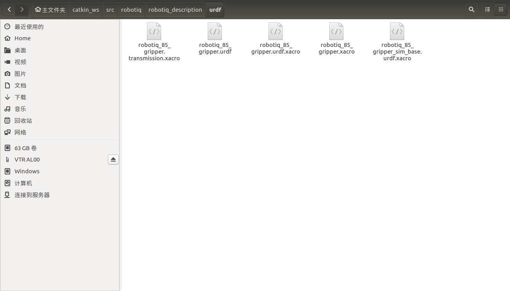
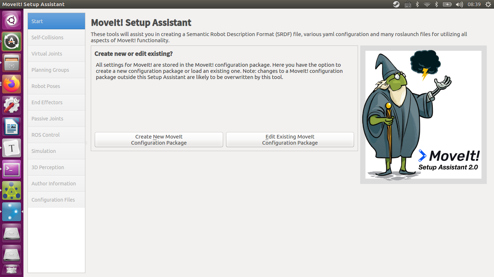
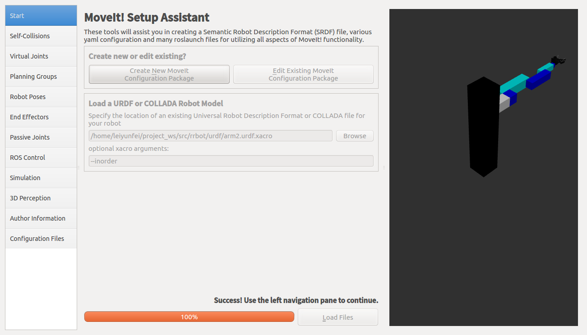
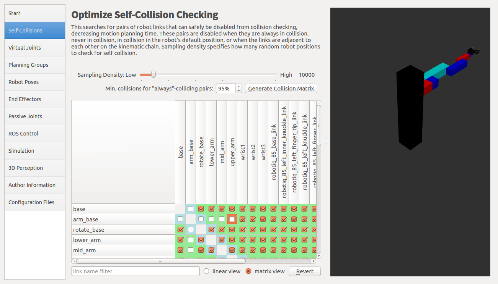
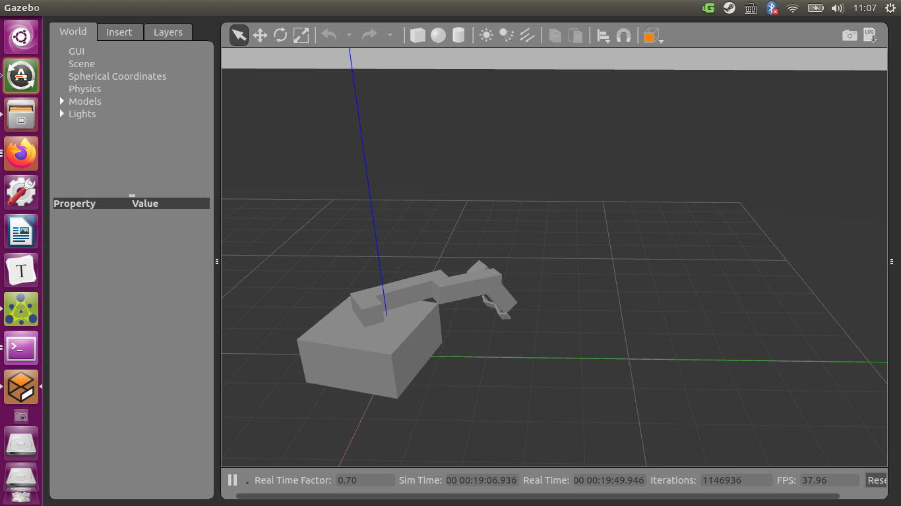

# 7.4 XACRO

```
首先简单简介xacro的使用方法，然后举个例子。
```

相信你在计算完所有的惯性张量后就再也不想写这些玩意了，当然如果你是在solidworks下已经得到了所有的数值，这也不是非常麻烦。但是观察一下urdf文件，你就会发现有很多重复的代码，每个代码段携带的信息并不是很多，这样既不利于代码的书写，代码的管理也不是很容易。这时候就需要，xacro，也就是xml macro。主要包括：xacro property，xacro macro，xacro include。

## 1. xacro property

你可以将它想作C中的宏定义，用来定义大量出现的不变的量，或者不想再写出值的量（比如小数点后很多位的数值）

1. ```xml
   <xacro:property name="the_radius" value="2.1" />
   <xacro:property name="the_length" value="4.5" />
   
   <geometry type="cylinder" radius="${the_radius}" length="${the_length}" />
   ```

2. ```xml
   <xacro:property name="front_left_origin">
     <origin xyz="0.3 0 0" rpy="0 0 0" />
   </xacro:property>
   <pr2_wheel name="front_left_wheel">
     <xacro:insert_block name="front_left_origin" />
   </pr2_wheel>
   ```

这两种分别声明了一个量和一个块为xacro property，并展示了如何调用。

## 2. 数学计算

```
将数学表达式放到${}中，就可以实现在它出现的地方进行数学计算。
```

如：

```xml
<xacro:property name="radius" value="4.3" />
<circle diameter="${2 * radius}" />
```

定义的property也可以直接进行计算。

在版本jade之后，xacro property可以自动使用python math库的常量以及数学函数。

## 3. 条件块

```xml
<xacro:if value="<expression>">
  <... some xml code here ...>
</xacro:if>
<xacro:unless value="<expression>">
  <... some xml code here ...>
</xacro:unless>
```

当表达式的值为0 true或者1 false时，不会报错。

在版本jade中，多有expression都可以使用python中的判断。

## 4. ROSPACK 命令

在$()中可以使用rospack的命令：

```xml
<foo value="$(find xacro)" />
<foo value="$(arg myvar)" />
```

在版本indigo中新加入功能，就是可以给arg赋予default值：

```xml
<xacro:arg name="myvar" default="false"/>
```

## 5. XACRO MACRO

这是xacro最大的功能，你可以将它当作函数。

```xml
<xacro:macro name="pr2_caster" params="suffix *origin **content **anothercontent">
  <joint name="caster_${suffix}_joint">
    <axis xyz="0 0 1" />
  </joint>
  <link name="caster_${suffix}">
    <xacro:insert_block name="origin" />
    <xacro:insert_block name="content" />
    <xacro:insert_block name="anothercontent" />
  </link>
</xacro:macro>

<xacro:pr2_caster suffix="front_left">
  <pose xyz="0 1 0" rpy="0 0 0" />
  <container>
    <color name="yellow"/>
    <mass>0.1</mass>
  </container>
  <another>
    <inertial>
      <origin xyz="0 0 0.5" rpy="0 0 0"/>
      <mass value="1"/>
      <inertia ixx="100"  ixy="0"  ixz="0" iyy="100" iyz="0" izz="100" />
    </inertial>
  </another>
</xacro:pr2_caster>
```

xacro:macro 指明name，宏名称，与params参数，参数不带*的就是单个参数,带一个\*就是代表是一个块参数，两个\*表示可以写很多块。在后面的调用中不一定使用与块参数相同的名称：比如上面的就将container和another代替了content和anothercontent。

展开后：

```xml
<joint name="caster_front_left_joint">
  <axis xyz="0 0 1" />
</joint>
<link name="caster_front_left">
  <pose xyz="0 1 0" rpy="0 0 0" />
  <color name="yellow" />
  <mass>0.1</mass>
  <inertial>
    <origin xyz="0 0 0.5" rpy="0 0 0"/>
    <mass value="1"/>
    <inertia ixx="100"  ixy="0"  ixz="0" iyy="100" iyz="0" izz="100" />
  </inertial>
</link>
```

多个块参数遵循定义时的顺序展开：

```xml
<xacro:macro name="reorder" params="*first *second">
  <xacro:insert_block name="second"/>
  <xacro:insert_block name="first"/>
</xacro:macro>
<reorder>
  <first/>
  <second/>
</reorder>
```

先展开second然后才是first。

macro也可以包含其他的macro：

```xml
<a>
  <xacro:macro name="foo" params="x">
    <in_foo the_x="${x}" />
  </xacro:macro>

  <xacro:macro name="bar" params="y">
    <in_bar>
      <xacro:foo x="${y}" />
    </in_bar>
  </xacro:macro>

  <xacro:bar y="12" />
</a>
```

外部的macro会先展开：

```xml
<a>
  <in_bar>
    <in_foo the_x="12.0"/>
  </in_bar>
</a>
```

默认参数：

在版本indigo之后：

```xml
<xacro:macro name="foo" params="x:=${x} y:=${2*y} z:=0"/>
```

在定义的时候，就可以指明默认参数。

在版本jade之后：

```xml
<xacro:macro name="foo" params="p1 p2:=expr_a p3:=^ p4:=^|expr_b">
```

^表示使用外部定义的property值,|表示如果没有外部定义的值就使用后面的备用值。

## 6. including

xacro还可以使用其他的xacro文件：

```xml
<xacro:include filename="$(find package)/other_file.xacro" />
<xacro:include filename="other_file.xacro" />
<xacro:include filename="$(cwd)/other_file.xacro" />
```

第一条就是找到一个包下的一个xacro文件并包含，与linux的文件目录相同。

在版本jade之后，为了防止文件名冲突造成影响，可以在：

```xml
<xacro:include filename="other_file.xacro" ns="namespace"/>
```

在后面加上ns，也就是命名空间。

调用时：

```xml
${namespace.property}
```

## 7. 必须的声明：

```
如果直接将这个文件launch是不行的，你还需在robot标签中加入xmlns，也就是xml命名空间：
```

```xml
<robot name="arm" xmlns:xacro="http://www.ros.org/wiki/xacro">
```

指明了xacro的规则来自ros官网。

## 8. 转换成urdf

在最近的几个版本中：

```shell
rosrun xacro xacro --inorder file.xacro > file.urdf
```

同理，在launch文件中的robot description参数中也需要将其加入例如：

```xml
<?xml version="1.0"?>
<launch>
    <arg name="gui" default="true" />
    <arg name="rvizconfig" default="$(find rrbot)/config/arm1.rviz" />
  
    <param name="use_gui" value="true" />
    <param name="robot_description" command="$(find xacro)/xacro --inorder ‘$(find rrbot)/urdf/arm1.urdf.xacro’" />
    <node name="joint_state_publisher" pkg="joint_state_publisher" type="joint_state_publisher" />
    <node name="robot_state_publisher" pkg="robot_state_publisher" type="state_publisher" />
    <node pkg="rviz" type="rviz" name="rviz" args="-d $(arg rvizconfig)" required="true" />

</launch>
```


'\<param name="robot_description" command="$(find xacro)/xacro --inorder ‘$(find rrbot)/urdf/arm1.urdf.xacro’" />'


## 9. 最小结构使用xacro

如果对于xacro不是非常熟悉，建议先从简单的开始。

```xml
<?xml version="1.0"?>
    <robot name="arm" xmlns:xacro="http://www.ros.org/wiki/xacro">

        <xacro:macro name="boxes" params="called x y z">
            <link name="${called}">
                <visual>
                    <geometry>
                        <box size="${x} ${y} ${z}" />
                    </geometry>
                </visual>
                <collision>
                    <geometry>
                        <box size="${x} ${y} ${z}" />
                    </geometry>
                </collision>
            </link>
        </xacro:macro>

        <xacro:boxes called="base" x="2" y="2" z="1" />

        <link name="arm_base">
            <visual>
                <geometry>
                    <cylinder length="0.01" radius="0.2" />
                </geometry>
                <origin rpy="0 0 0" xyz="0 0 0.005" />
            </visual>
        </link>

        <joint name="base_to_arm_base" type="continuous">
            <parent link="base" />
            <child link="arm_base" />
            <origin rpy="0 0 0" xyz="0 0 0.5" />
            <axis xyz="0 0 1" />
        </joint>

    </robot>
```

这个xacro文件只是定义了一个link的macro。

## 10. 上个机械臂的简化

```xml
<?xml version="1.0"?>
<robot xmlns:xacro="http://www.ros.org/wiki/xacro" name="arm0">

    <material name="white">
        <color rgba="1 1 1 1" />
    </material>

    <material name="blue">
        <color rgba="0 0 1 1" />
    </material>

    <material name="black">
        <color rgba="0 0 0 1" />
    </material>

    <material name="yellow">
        <color rgba="0 1 1 1" />
    </material>

    <material name="green">
        <color rgba="0 1 0 1" />
    </material>
    
    <xacro:property name="pi" value="3.1415" />
    <xacro:property name="velocity" value="0.5" />

    <xacro:macro name="cylinder_inertial_matrix" params="mass radius length">
        <inertial>
            <mass value="${mass}" />
            <inertia ixx="${0.0833333*mass*(30.5*radius*radius+length*length)}" ixy="0" ixz="0"
                    iyy="${0.0833333*mass*(3*radius*radius+length*length)}" iyz="0"
                    izz="${0.5*mass*radius*radius}" />
        </inertial>
    </xacro:macro>

    <xacro:macro name="box_inertial_matrix" params="mass length width height">
        <inertial>
            <mass value="${mass}" />
            <inertia ixx="${0.0833333*mass*(width*width+height*height)}" ixy="0" ixz="0"
                    iyy="${0.0833333*mass*(length*length+height*height)}" iyz="0"
                    izz="${0.0833333*mass*(width*width+height*height)}" />
        </inertial>
    </xacro:macro>

    <xacro:macro name="robot_arm0" params="prefix">
        <link name="${prefix}_base">
            <visual>
                <geometry>
                    <box size="2 2 1" />
                </geometry>
                <material name="black" />
            </visual>
            <collision>
                <geometry>
                    <box size="2 2 1" />
                </geometry>
            </collision>
            <xacro:box_inertial_matrix mass="30" length="2" width="2" height="1" />
        </link>

        <link name="${prefix}_arm_base">
            <visual>
                <geometry>
                    <cylinder length="0.01" radius="0.2" />
                </geometry>
                <origin rpy="0 0 0" xyz="0 0 0.005" />
                <material name="green" />
            </visual>
            <collision>
                <geometry>
                    <cylinder length="0.01" radius="0.2" />
                </geometry>
                <origin rpy="0 0 0" xyz="0 0 0.005" />
            </collision>
            <xacro:cylinder_inertial_matrix mass="0.001" radius="0.2" length="0.01" />
        </link>

        <joint name="base_to_arm_base" type="revolute">
            <parent link="${prefix}_base" />
            <child link="${prefix}_arm_base" />
            <origin rpy="0 0 0" xyz="0 0 0.5" />
            <axis xyz="0 0 1" />
            <limit effort="1000" lower="${-1*pi}" upper="${pi}" velocity="${velocity}" /> 
        </joint>

        <link name="${prefix}_lower_arm0">
            <visual>
                <geometry>
                    <box size="0.4 0.4 0.4" />
                </geometry>
                <origin rpy="0 0 0" xyz="0 0 0.2" />
                <material name="white" />
            </visual>
            <collision>
                <geometry>
                    <box size="0.4 0.4 0.4" />
                </geometry>
                <origin rpy="0 0 0" xyz="0 0 0.2" />
            </collision>
            <xacro:box_inertial_matrix mass="0.4" length="0.4" width="0.4" height="0.4" />
        </link>

        <joint name="arm_base_to_lower_arm0" type="fixed">
            <parent link="${prefix}_arm_base" />
            <child link="${prefix}_lower_arm0" />
            <origin rpy="0 0 0" xyz="0 0 0.005" />
        </joint>

        <link name="${prefix}_lower_arm">
            <visual>
                <geometry>
                    <box size="0.4 0.4 2" />
                </geometry>
                <origin rpy="0 0 0" xyz="-0.2 0 0.8" />
                <material name="blue" />
            </visual>
            <collision>
                <geometry>
                    <box size="0.4 0.4 2" />
                </geometry>
                <origin rpy="0 0 0" xyz="-0.2 0 0.8" />
            </collision>
            <xacro:box_inertial_matrix mass="2" length="0.4" width="0.4" height="2" />
        </link>

        <joint name="lower_arm0_to_lower_arm" type="revolute">
            <parent link="${prefix}_lower_arm0" />
            <child link="${prefix}_lower_arm" />
            <origin rpy="0 0 0" xyz="-0.2 0 0.2" />
            <limit effort="1000" lower="${-0.5*pi}" upper="${0.5*pi}" velocity="${velocity}" />
        </joint>

        <link name="${prefix}_mid_arm">
            <visual>    
                <geometry>  
                    <box size="0.4 0.4 1.5" />
                </geometry>
                <origin rpy="0 0 0" xyz="0.2 0 0.55" />
                <material name="white" />
            </visual>
            <collision>
                <geometry>  
                    <box size="0.4 0.4 1.5" />
                </geometry>
                <origin rpy="0 0 0" xyz="0.2 0 0.55" />
            </collision>
            <xacro:box_inertial_matrix mass="1.5" length="0.4" width="0.4" height="1.5" />
        </link>

        <joint name="lower_arm_to_mid_arm" type="revolute">
            <parent link="${prefix}_lower_arm" />
            <child link="${prefix}_mid_arm" />
            <origin rpy="0 0 0" xyz="0 0 1.6" />
            <limit effort="800" lower="${-0.5*pi}" upper="${0.5*pi}" velocity="${velocity}" />
        </joint>

        <link name="${prefix}_upper_arm">
            <visual>
                <geometry>
                    <box size="0.4 0.4 1" />
                </geometry>
                <origin rpy="0 0 0" xyz="-0.2 0 0.3" />
                <material name="blue" />
            </visual>
            <collision>
                <geometry>
                    <box size="0.4 0.4 1" />
                </geometry>
                <origin rpy="0 0 0" xyz="-0.2 0 0.3" />
            </collision>
            <xacro:box_inertial_matrix mass="1" length="0.4" width="0.4" height="1" />
        </link>

        <joint name="mid_arm_to_upper_arm" type="revolute">
            <parent link="${prefix}_mid_arm" />
            <child link="${prefix}_upper_arm" />
            <origin rpy="0 0 0" xyz="0 0 1.1" />
            <limit effort="600" lower="${-0.5*pi}" upper="${0.5*pi}" velocity="${velocity}" />
         </joint>

        <link name="${prefix}_gripper_base">  
            <visual>
                <geometry>
                    <box size="0.4 0.4 0.4" />
                </geometry>
                <material name="white" />
            </visual>
            <collision>
                <geometry>
                    <box size="0.4 0.4 0.4" />
                </geometry>
            </collision>
            <box_inertial_matrix mass="0.4" length="0.4" width="0.4" height="0.4" /> 
        </link>

        <joint name="upper_arm_to_gripper_base" type="revolute">
            <parent link="${prefix}_upper_arm" />
            <child link="${prefix}_gripper_base" />
            <origin rpy="0 0 0" xyz="-0.2 0 1" />
            <axis xyz="0 0 1" />
            <limit effort="500" lower="${-0.5*pi}" upper="${0.5*pi}" velocity="${velocity}" />
        </joint>

        <link name="${prefix}_left_gripper0">
            <visual>
                <geometry>
                    <box size="0.4 0.05 0.2" />
                </geometry>
                <origin xyz="-0.2 -0.1 0" rpy="0 0 0.523598775" />
                <material name="green" />
            </visual>
            <collision>
                <geometry>
                    <box size="0.4 0.05 0.2" />
                </geometry>
                <origin xyz="-0.2 -0.1 0" rpy="0 0 0.523598775" />
            </collision>
            <box_inertial_matrix mass="0.1" length="0.4" width="0.05" height="0.2" />
        </link>

        <joint name="gripper_base_to_left_gripper0" type="revolute">
            <parent link="${prefix}_gripper_base" />
            <child link="${prefix}_left_gripper0" />
            <origin rpy="0 0 0" xyz="-0.2 0 0" />
            <axis xyz="0 0 1" />
            <limit effort="2000" lower="0" upper="1" velocity="${velocity}" />
        </joint>

        <link name="${prefix}_right_gripper0">
            <visual>
                <geometry>
                    <box size="0.4 0.05 0.2" />
                </geometry>
                <origin xyz="-0.2 0.1 0" rpy="0 0 -0.523598775" />
                <material name="green" />
            </visual>
            <collision>
                <geometry>
                    <box size="0.4 0.05 0.2" />
                </geometry>
                <origin xyz="-0.2 0.1 0" rpy="0 0 -0.523598775" />
            </collision>
            <xacro:box_inertial_matrix mass="0.1" length="0.4" width="0.05" height="0.2" />
        </link>

        <joint name="gripper_base_to_right_gripper0" type="revolute">
            <parent link="${prefix}_gripper_base" />
            <child link="${prefix}_right_gripper0" />
            <origin rpy="0 0 0" xyz="-0.2 0 0" />
            <axis xyz="0 0 1" />
            <limit effort="2000" lower="-1" upper="0" velocity="${velocity}" />
        </joint>

        <link name="${prefix}_left_gripper1">
            <visual>
                <geometry>
                    <box size="0.2 0.05 0.2" />
                </geometry>
                <origin xyz="-0.1 0 0" />
            </visual>
            <collision>
                <geometry>
                    <box size="0.2 0.05 0.2" />
                </geometry>
                <origin xyz="-0.1 0 0" />
            </collision>
            <xacro:box_inertial_matrix mass="0.08" length="0.2" width="0.05" height="0.2" />
        </link>

        <joint name="left_gripper_part2" type="revolute">
            <parent link="${prefix}_left_gripper0" />
            <child link="${prefix}_left_gripper1" />
            <origin rpy="0 0 0" xyz="-0.346410161 -0.2 0" />
            <axis xyz="0 0 1" />
            <limit effort="1500" lower="${-0.5*pi}" upper="${0.5*pi}" velocity="${velocity}" />
        </joint>

        <link name="${prefix}_right_gripper1">
            <visual>
                <geometry>
                    <box size="0.2 0.05 0.2" />
                </geometry>
                <origin xyz="-0.1 0 0" />
            </visual>
            <collision>
                <geometry>
                    <box size="0.2 0.05 0.2" />
                </geometry>
                <origin xyz="-0.1 0 0" />
            </collision>
            <xacro:box_inertial_matrix mass="0.08" length="0.2" width="0.05" height="0.2" />
        </link>

        <joint name="right_gripper_part2" type="revolute">
            <parent link="${prefix}_right_gripper0" />
            <child link="${prefix}_right_gripper1" />
            <origin rpy="0 0 0" xyz="-0.346410161 0.2 0" />
            <axis xyz="0 0 1" />
            <limit effort="1500" lower="${0.5*pi}" upper="${-0.5*pi}" velocity="${velocity}" />
        </joint>
    </xacro:macro>

</robot>
```

其实这个机械臂的文件只有计算惯性张量比较复杂，而且我想使用xacro将这个机械臂制作成一个包，简化的内容其实不多，仿照ur5的机械臂写的。

定义了实心圆柱和实心长方体的惯性张量的计算。然后在一个arm带有一个参数为prefix的macro块里写了整个机械臂的声明。然后并没有调用这个macro，而是在另一个xacro文件里include了这个机械臂的xacro文件：

```xml
<?xml version="1.0"?>
<robot name="arm" xmlns:xacro="http://www.ros.org/wiki/xacro" >

  <!-- common stuff -->
  <xacro:include filename="$(find rrbot)/urdf/arm1.urdf.xacro" />

  <!-- arm -->
  <xacro:robot_arm0 prefix=""/>

</robot>
```

这样可以实现这个机械臂代码的复用，这也是xacro的一大特点之一。

对应的launch文件：

```xml
<?xml version="1.0"?>
<launch>
    <arg name="gui" default="true" />
    <arg name="rvizconfig" default="$(find rrbot)/config/arm1.rviz" />
  
    <param name="use_gui" value="true" />
    <param name="robot_description" command="$(find xacro)/xacro --inorder $(find rrbot)/urdf/arm1_joint_limited.urdf.xacro" />
    <node name="joint_state_publisher" pkg="joint_state_publisher" type="joint_state_publisher" />
    <node name="robot_state_publisher" pkg="robot_state_publisher" type="state_publisher" />
    <node pkg="rviz" type="rviz" name="rviz" args="-d $(arg rvizconfig)" required="true" />

</launch>
```

只需要launch这个文件即可。

## 11. 关于bug

```
我之前没有接触过xml，也不知道linux下有什么好的xml debug工具，在这给大家介绍几个方法。
```

### 11.1 xmllint linux终端自带的xml检错工具

```shell
leiyunfei@leiyunfei-ThinkPad-T460:~/catkin_ws/src/ur5/ur5_description$ xmllint --noout 
```

xmllint的参数有很多种，一般我用的是`--noout`这个参数。

### 11.2 转换xacro为urdf

还记得我们的操作：

```shell
leiyunfei@leiyunfei-ThinkPad-T460:~/catkin_ws/src/ur5/ur5_description$ rosrun xacro xacro --inorder  > 
```

运行这个操作就可以知道那个地方有错误。

### 11.3 直接launch

直接使用对应的launch文件，如果有错误，第一行就会显示。

## 12. 使用别的xacro

首先，观察一下我从github上克隆的一个机械臂抓手的xacro文件结构和代码：




其实我们只有着一份在rviz中看机器人模型是远远不够的，还需要后续的为控制机器人或别的xacro部分很多的代码。包括，gazebo中的颜色，传动，硬件接口和各种plugin。这里我们需要注意的是robotiq85的xacro和.urdf.xacro。


## 13. launch文件的编写

与上一个urdf不同的是需要在robot description中加入解析xacro为urdf的命令：

```xml
<param name="robot_description" command="$(find xacro)/xacro --inorder $(arg model)" />
```

## 14. moveit_setup_assiatant的使用

启动moveit_setup_assistant:

```shell
rosrun moveit_setup_assistant
```



点左边导入urdf文件：



**自碰撞检测：**点击下面的matrix-view，我不想使arm_base与其他的部位发生碰撞，就点掉他的所有检测。



**虚拟关节**

添加一个虚拟关节和虚拟连杆。按自己的需求添加，因为这个还没有写gazebo的urdf，所以我有一个。

**规划组**

第一个arm：

运动学解析器一般选第一个KDL。

后面几个求解时间，求解超时，和重新求解次数一般不用改。

然后add joint，add link将arm部分（所有非fixed即可）全部加入即可，chain的话将加入的第一个link设为base link，最后一个设为tip link。

第二个gripper：

注意只加入link。

**机器人姿态**

在这个里面你可以检查一下自己的规划组是否合理。

**end effector**

最后端力力施加于gripper。

其他的先不用管，生成后可以launch生成包里的demo.launch 进行操作。





