## 9.2 机械臂的Moveit！

**本讲重点**

- Moveit!简介
- Moveit!的可视化配置
- Rviz可视化界面的操作演示

**教学目的**

- 了解Moveit基础知识
- 熟练掌握Moveit! Setup Assistant可视化配置工具使用方法
- 熟练使用Moveit！Rviz可视化界面操作

这讲的分享内容主要分为三部分，第一部分是Moveit简介，主要介绍他的架构以及背景，

第二个部分是Moveit的可视化配置，介绍如何从机械臂的urdf文件通过Moveit! Setup Assistant这个可视化配置工具，配置一个可以由moveit控制的机械臂。

第三个部分是Moveit！RVIZ可视化界面的操作演示，介绍一下在gui中的正确操作与它给我们提供的基本功能。

首先我们来看Movei!的简介。

### 1. 机械臂的Moveit！

#### 1.1 Moveit的发展现状

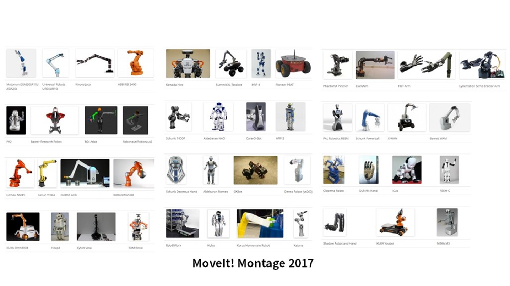

自从2012年moveit发布之后，他的发展是非常迅速的，目前已经有非常多种类的机器人可以支持moveit，包括工业机器人、协作机器人、人形机器人等。 那么到底什么是moveit呢？

#### 1.2 Moveit!的定义

moveit它是一个易于使用的集成化开发平台啊，首先他是一个开发平台，所以它的功能应该是非常丰富的。他是由一系列移动操作的功能包所组成，这些功能包包括： 运动控制、操作控制、三D感知、运动学控制与导航算法等等。 而且moveit的他为我们提供了一种友好的GUI，这个GUI就类似于右图所示，它是基于ROS的rviz插件，可以在rviz里面实现很多可视化的运动控制功能。  moveit它是可以用在很多工业商业研发以及其它领域的，目前他已经成为了ROS社区当中使用度排名前三的功能包。

#### 1.3 Moveit的框架

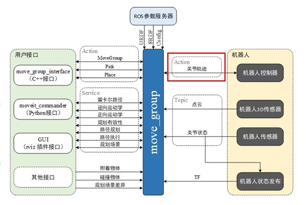

我们来看一下moveit的系统架构，moveit使用的一个核心节点叫做movegroup，他可以综合多个机器人的独立组件，为用户提供多种动作指令和服务。我们可以看一下这张图当中，除了中心的核心movegroup节点之外，可以大概分为三个部分：用户接口、ROS参数服务、机器人。

用户接口userinterface：它是moveit提供用户的一些接口，这些接口主要分为三种，其中两种是编程的接口，也就是c++与python接口。另外一个的话是图形界面的接口，也就是GUI它是基于RVIZ的一个插件。

ROS参数服务器ROS param server：它可以为movegroup这个节点的处理提供很多比如说：机器人的URDF模型、srdf文件也就是机器人的一些配置文件，这些个配置文件我们一会会在moveit的配置工具中取生成。另外还有很多的配置文件、配置信息需要我们的ROS参数服务器给movegroup提供。

此外就是机器人相关部分，我们可以看到这边红色框中有一个JointTrajectoryAction这是一个ROS当中的一个Action，它主要负责机器人控制器与movegroup之间的交互，这个action是非常重要的，moveit里面所有的规划完成之后，会通过这个action把它发布给机器人控制器，然后机器人控制器再进行规划插补、轨迹控制等算法。机器人控制器中还包括了机器人传感器、以及机器人的状态信息以及机器人的TF信息，还有一些机器人的关节信息等一些话题，这些话题都需要发送给movegroup，movegroup会通过一些插件机制，来整合这些信息，做到比如：避障、轨迹规划等一些功能。

### 2. Moveit!的可视化配置

关于moveit的简介我们就介绍到这里，下面呢我们就进入重点，Moveit！的可视化配置。通过我们已有的机械臂URDF模型创造一个机器人出来。

#### 2.1 相关功能包的安装

我们需要提前安装一些相关的功能包

1. 首先安装Moveit, 在终端运行： `sudo apt-get install ros-kinetic-moveit`

2. 然后安装MoveIt! Setup Assistant，在终端运行： `sudo apt-get install ros-kinetic-franka-description`

3. 创建dobot_ws/src文件夹，将dobot  magician文件夹放入src文件夹下

4. 编译功能包：在dobot\_ws目录下，运行：catkin_make

5. source: `source devel/setup.bash`

MoveIt! Setup Assistant是一个图形用户界面，用于为与MoveIt!一起使用的机器人生成配置文件。

下面以Dobot magician为例，演示使用MoveIt! Setup Assistant进行可视化配置的过程：这张图片就是我们dubot的2d图片。

#### 2.2 Moveit! 的可视化配置流程

首先运行 `roscore`

然后运行 `rosrun moveit_setup_assistant moveit_setup_assistant` 就可以打开Moveit! set assistant的可视化配置界面。

1. Moveit! Setup Assistant

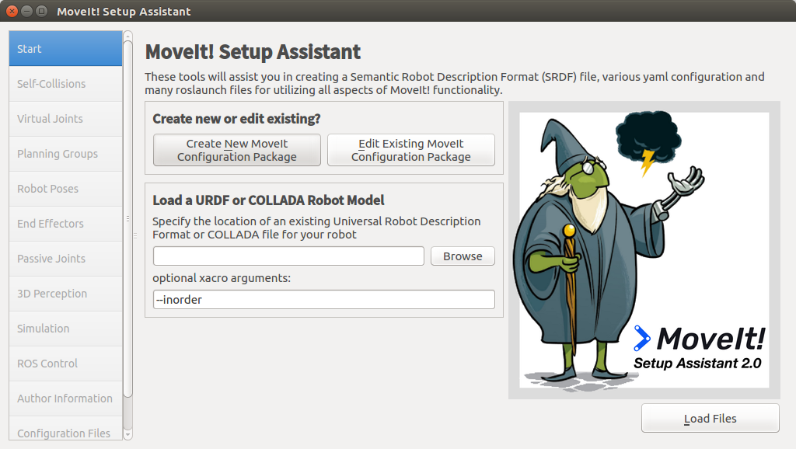

启动之后就是类似于这个界面，在这个界面里面有两个按钮，一个是去创建一个新的工具功能包另外一个是去编辑已有的功能包。因为我们现在假设我们刚刚创建完成，这样一个URDF文件的一个模型，所以我们还没有对他进行配置，也就是说，我们这里需要去创建一个新的配置文件的一个功能包。所以我们去点击左边的这个按钮来创建一个全新的配置功能包。

2. Load Model

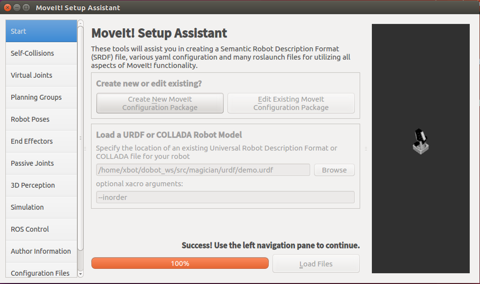

点击创建新的功能包之后，我们可以在下面弹出的，这样一个对话框里面去选择我们需要的urdf模型.嗯大家可以去选择你们自己创建的urdf文件模型，选择之后可以去点击下面的load files，然后去把这个模型加载进来，加载完成的话，可以在右边的这个显示框里面就可以看到我们的模型是不是我们需要去做配置的。

3. Self—Collisions

加载完成机器人模型之后，大家可以点击这个工具左侧列表，我们可以来到第二项配置，第二项配置是关于自碰撞矩阵的一个设置，Moveit它可以让我们设置一定数量的随机采样点，然后根据这些点生成一些碰撞参数，检测那些永远不会发生碰撞的立刻。可想而知，如果我们有过多的点可能会造成运算速度很慢，过少的点可能会导致参数不完善，然后默认的采样点的数量是1万个，官方称经过实践的话，1万个采样点可以获得不错的效果，所以我们就可以直接使用默认的1万个采样点，然后点击 Generate 这样的一个按钮来生成碰撞矩阵。

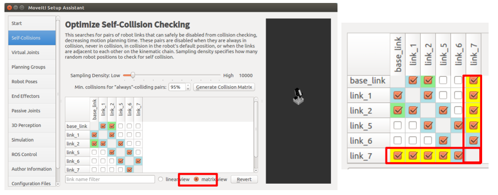

点击matrix view 勾选所有link_7对应的连接，由于link_7为机械臂连杆，我们在实际运行中默认其为被动关节，所以这里取消其对应的碰撞检测。

4. Virtual Frame

底盘固定在世界坐标系中的机械臂不用添加Virtual Frame，适用于移动机器人的机械臂。

关于虚拟关节的配置，虚拟关节它主要是用来描述机器人在世界坐标系下的位置，如果机器人是移动的话，虚拟关节可以与移动机做关联，因为我们这里设计的机械臂是固定不动的，所以不需要去设计虚拟关节。但是如果我们设置了固定的虚拟关节，对后面的操作也不会有影响。那我们这里就设置一个虚拟关节给大家演示一下设置的一些参数。

Virtual Joint Name 设置为 virtual；他的Child Link这里设置为机械臂的基坐标系 base_link，他的Parent frame name 设置为世界坐标系world，这个虚拟关节的类型就设置固定fixed

5. Planning Group

接下来是关于规划组的配置，这一步我们可以将机器人多个组成部分，这里面可能会包括多个link多个joint把集成到一个组当中，运动规划会针对这样一个组来完成运动规划，在配置过程当中我们可以去选择运动的解析器！这里我们需要去创建两个组，一个是机械臂旋转组，也就是dobot第一个关节的旋转部分，另外一个就是机械臂的三个平行关节这样一个规划组。

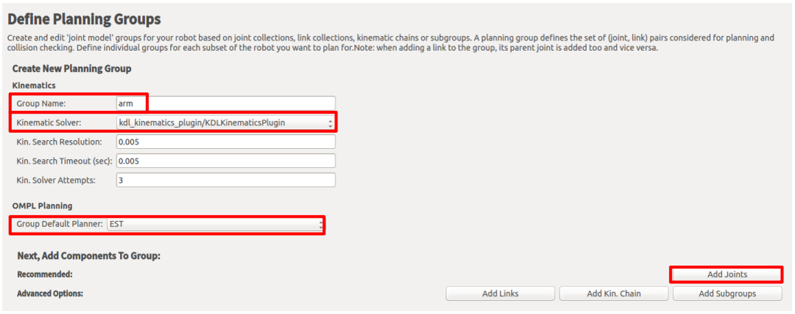

我们来创建机器人，首先我们来创建机器人dobot三个平型关节的这个规划组，需要去点击add group，然后后会出现上面这样的一个界面，在这个界面里面我们去需要去设置规划组的名称，我们这里叫做arm, 然后会要去设置运动学解析器的插件，这里用到的是KDL插件，然后下面会相应地设置一些的运动学解析的一些参数，最后选择运动规划方法，也就是OMPL Planning这个选项，这里选择EST

这些参数设置完成之后，选择Add Joints，那就会出现这个界面

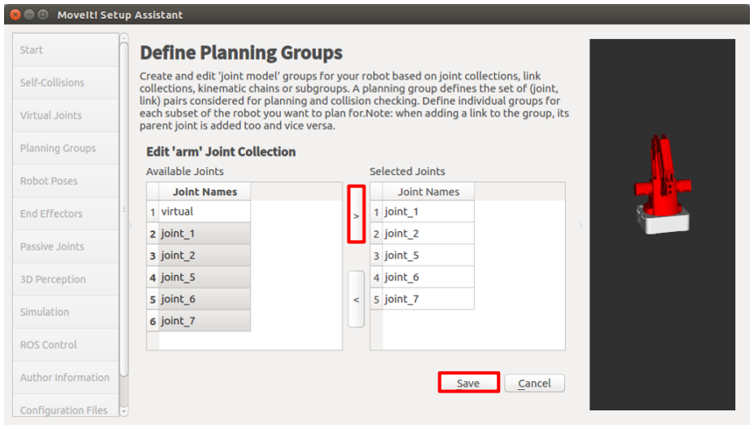

这这个界面中，我们选择关节1、2、5、6、7，加入到右侧，然后点击Save保存，也就是说在运动规划的时候，它就会针对我们这里所选择的这些link去规划。

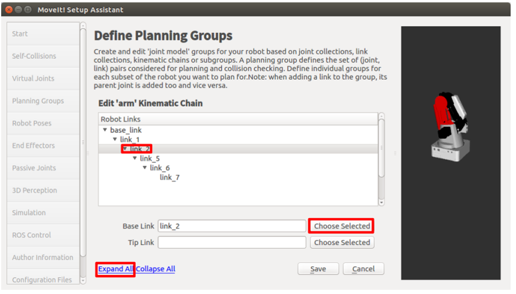

双击arm下的Chain，点击Expand All，选择link_2，点击Base Link对应的Choose
Selected

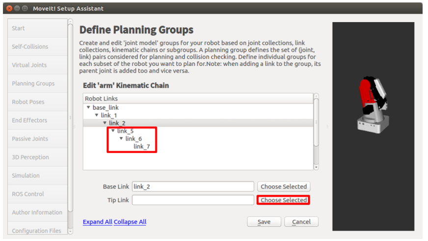

选择link_5，点击Tip Link对应的Choose Selected link_6，link_7也依次点击Tip
Link进行

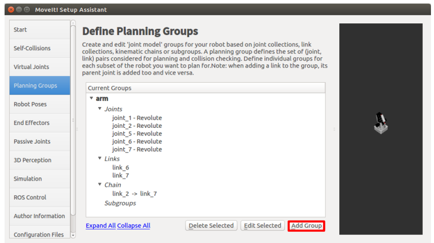

这样我们也可以完成arm部分的运动组建立，下面我们来完成旋转部分的建立
同样点击Add Group

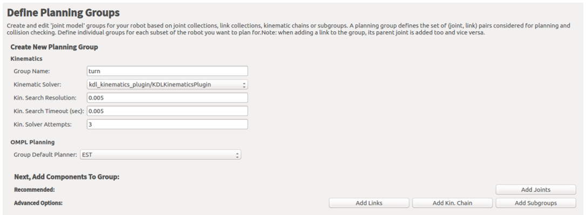

输入运动组的名称为turn，运动学解决方案为kdl，运动组OMPL为EST，点击Add
Joints

选择virtual与joint_1，加入右方后点击Save保存设置，这样两个规划组的设置就完成了。 一个是arm  一个是turn，分别针对我们机械臂的两个组成部分。

6. Robot Poses

接下来是Robot Poses在这一部分用户可以去设置一系列自定义的点位，点击Add
Pose按键。就会出现下面的界面。

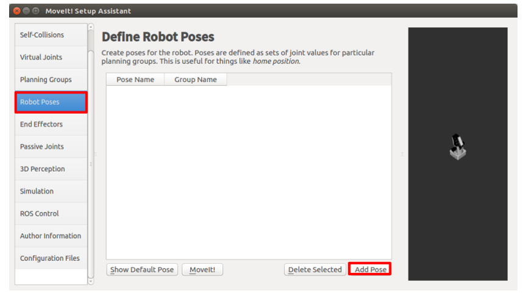

比如说这里我设置了一个称作为push的点位，然后确定规划组Planning Group为arm; 调节joint_1、2、5设置一个你喜欢的姿势，输入名称后点击Save保存。

这个点位的机器人姿态是我们觉得以后会容易用到的一个姿态，姿态自定义之后的一个好处就是我们可以通过程序直接去调用push这样的一个命名的点位，让机器人运动到这个姿态，这样的话我们就不用在程序里面去分别控制机器人的六个轴，回到push的姿态直接去调用比如说go to push，然后就可以让机器人回到这样的一个点位。

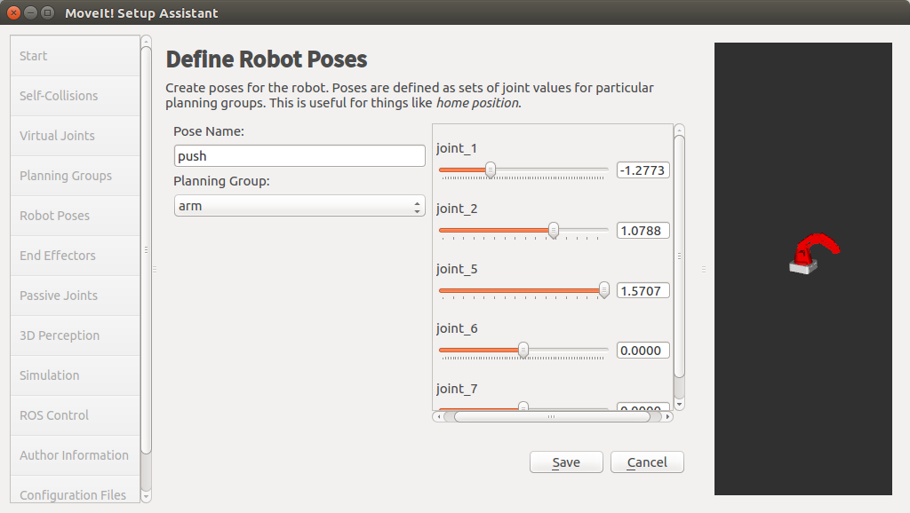

7. Passive Joints

Dobot机械臂URDF不需要配置夹爪，跳过End Effector设置在Passive Joints中选择连杆joint_7设置为被动关节

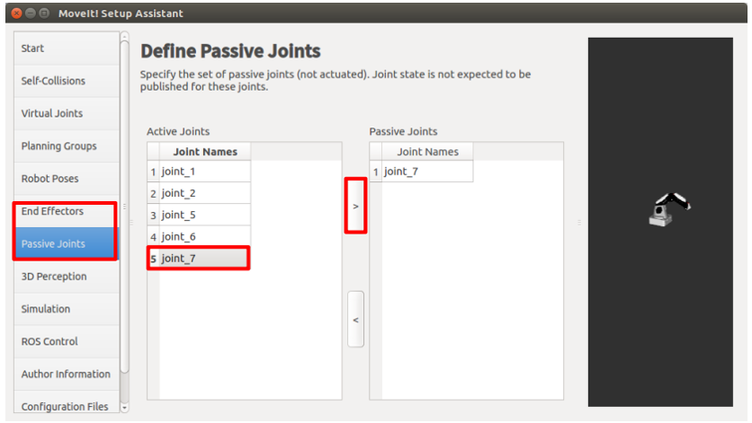

8. 3D Perception

设置 3D Perception，选择Optionally为Point Could，相等于配置了3D传感器的插件

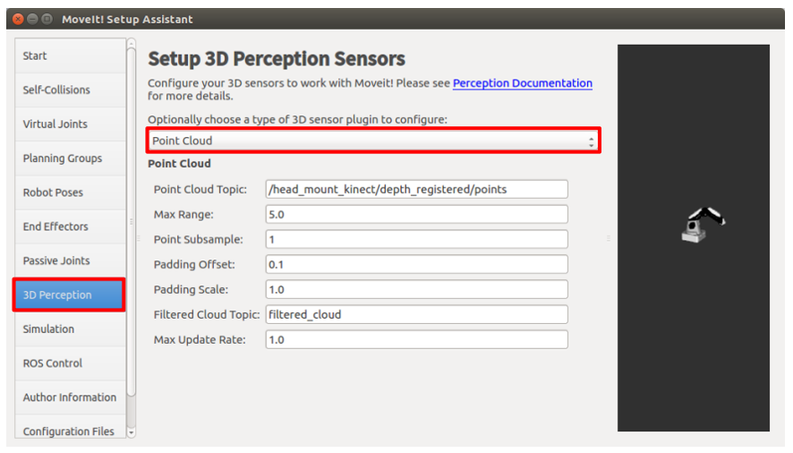

9. Simulate With Gazebo

在Simulation With Gazebo 中可以生成我们配置后的urdf文件

10.Setup ROS Controllers

在Ros Control中点击Auto Add，生成配置，这里通过setup assistant设置的Controllers不一定准确，在后面的仿真部分我们还会在配置文件中重新配置一遍的，这么可以先自动配置一下。

11.Author Information

在Author Information配置是关于作者信息的配置，当然大家可以在这里输入自己的名字邮箱，这样如果我们把这个功能包分享给其他人去使用的时候，其他人如果使用什么问题的话，可以随时跟作者取得联系。

12. Configuration Files

来到最后一步，我们可以选择配置文件的功能包所放置的路径，选择路径之后我们需要给功能包命名，命名的规则一般是机器人的名称加上Moveit\_config这样的一个命名规则，这里我们命名为dobot\_moveit_config。

点击生成功能包，如果功能包生成成功之后，可以看到下面的一个成功信息。到此为止，我们整个的配置流程就结束了，可以点击exit，然后就可以退出配置的小工具，至此，配置完成。

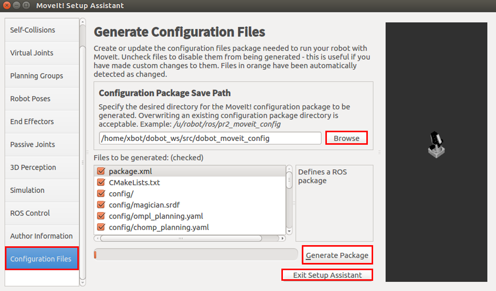

#### 2.3  功能包介绍

如果刚才配置成功之后，我们应该可以看到这样的一个功能包在指定的路径下生成，这里的功能包里面主要包含两个主要的文件夹，一个文件夹是launch文件夹，一个文件夹是config，launch文件夹里面主要存放的是跟机器人启动相关的一些启动文件，这些启动文件绝大部分我们是不需要去做修改的，只有个别的几个，我们可能在后面要做一些小小的修改，config文件夹下面的这些都是进行相关的配置信息。比如说这里的arm.srdf里面存储的就是刚才我们通过可视化界面配置的很多机器人的配置信息，joint_limits里面设置了包括机器人关节的运动速度限制，加速度限制等信息，如果我们觉得机器人运动速度较慢，可以通过这样的一个配置文件去提高机器人的运动速度。

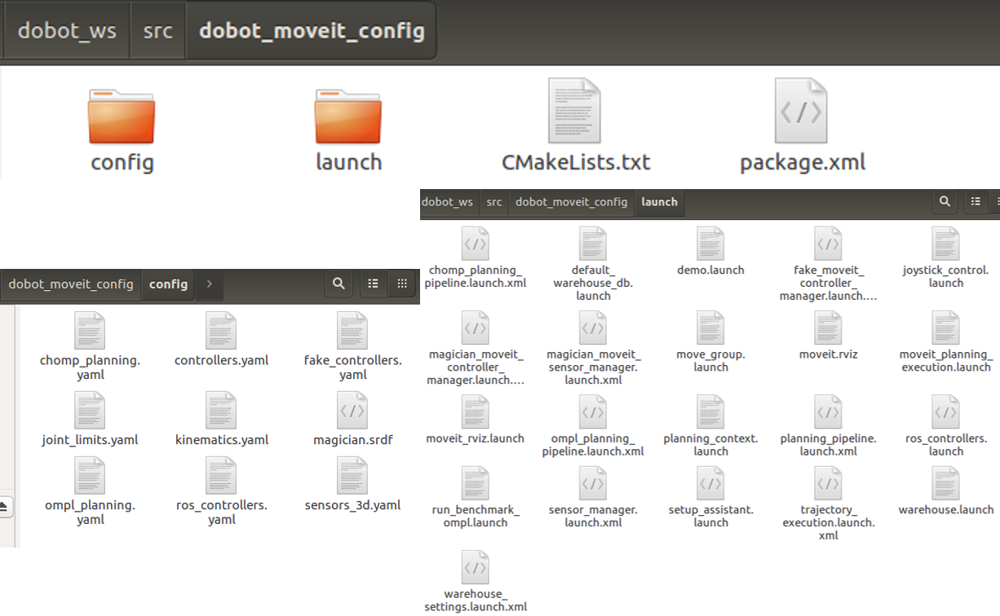

### 3. Rviz可视化界面的操作演示

#### 3.1 Moveit!操作界面的启动

1. 进入工作空间：`cd dobot_ws`
2. 编译工作空间：`catkin_make`

3. 添加都ROS路径：`source devel/setup.bash`

4. 启动moveit!的RVIZ操作界面：`roslaunch  dobot_moveit_config demo.launch`

#### 3.2 Moveit!操作界面介绍

启动成功之后可以看到RVIZ的界面，在这个界面里面有两个很重要的部分，第一个部分是左侧的Moveit的插件，通过这个插件，我们可以通过可视化的方法来实现很多运动控制的功能。右侧是机器人的状态显示，会实时的显示机器人的运动的一个姿态。

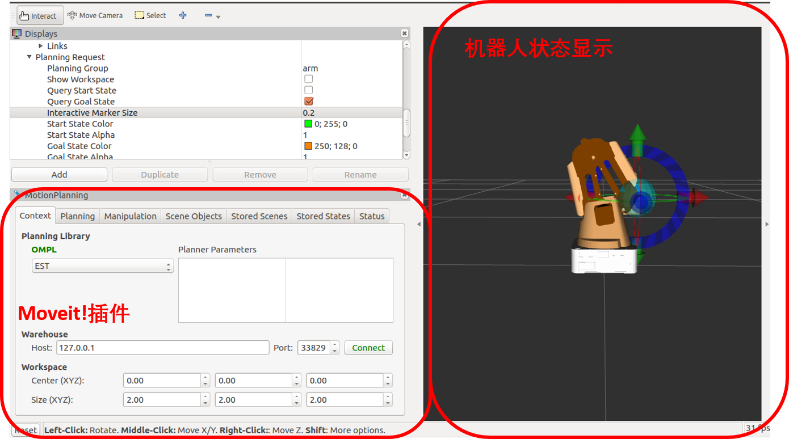

#### 3.3 Moveit!操作演示

接下来我们就来展示一下demo的一些主要功能，针对这些功能我也制作了一个简单的视频，课件的最后也会附上视频。

1. 拖动规划

首先第一个展示是拖动规划，大家可以用鼠标去点击右边显示区里面的机器人终端，这个终端里面有一个圆球环的一个标志，然后通过拖动这个圆球，我们可以改变机器人的姿态，然后选择一个你希望的姿态之后，再点击左侧Moveit插件里面的这样的一个**plan and Execute**的按钮，点击之后机器人就会从当前姿态运动到我们拖动的一个指定姿态

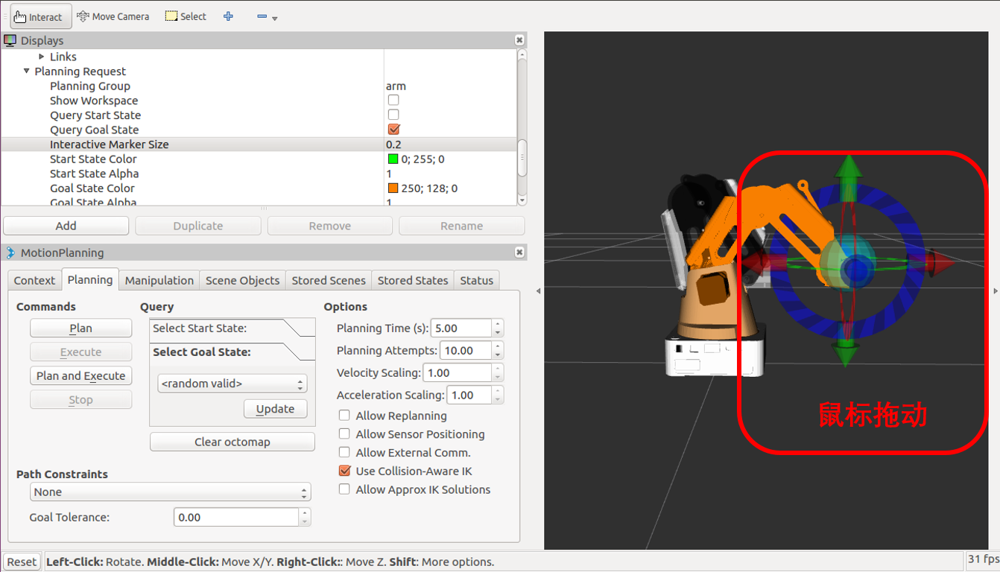

2. 随机目标点

我们也可以通过左侧Moveit的插件里面帮助机器人随机选择一个目标点，比如说这里我已经点击了update按钮，机器人产生了一个随机目标点，然后我们再去点击play and execute，这个时候机器人应该就可以从它的当前姿态运动到我们指定的随机姿态。

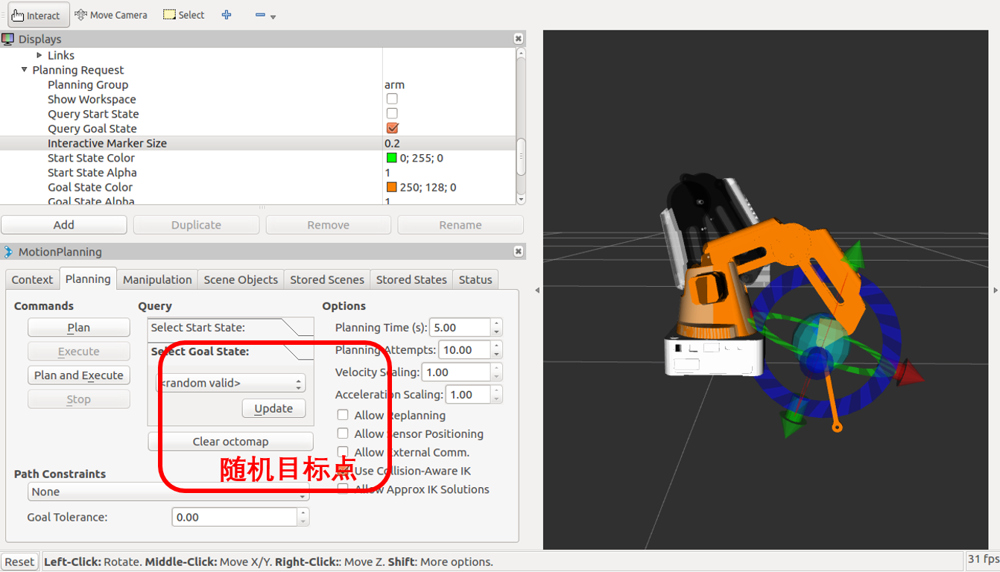

3. 设置初始点

我们也可以通过Moveit的插件来设置机器人的初始位姿，这样机器人就可以从我们设置的初始位运动到我们的指定的目标位置！

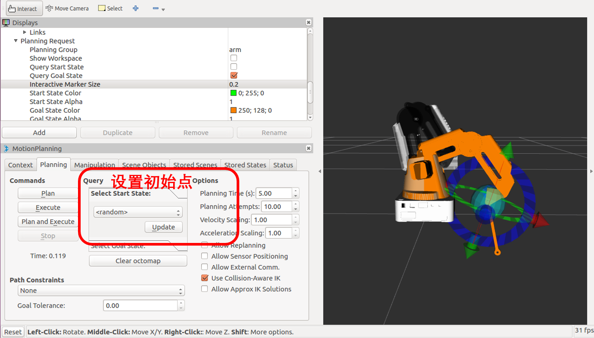

4. 添加其他物体

很多时候机器人的运动场景往往不是独立的，它需要配合周围的一些物体完成运动，我们也可以在Moveit这个插件里面去添加一些外界环境的物体，比如说我可以通过这里的 “Scene Objects”然后去点击 ”Import File”添加一个外界场景物体进入到我们可视区域里面，这里我添加了dobot的第二个link，通过这个link我们可以把它放置到机器人的场景的任何位置。可以通过Scale调整它的大小，调整Rotation与Positon可以调整它的位姿。

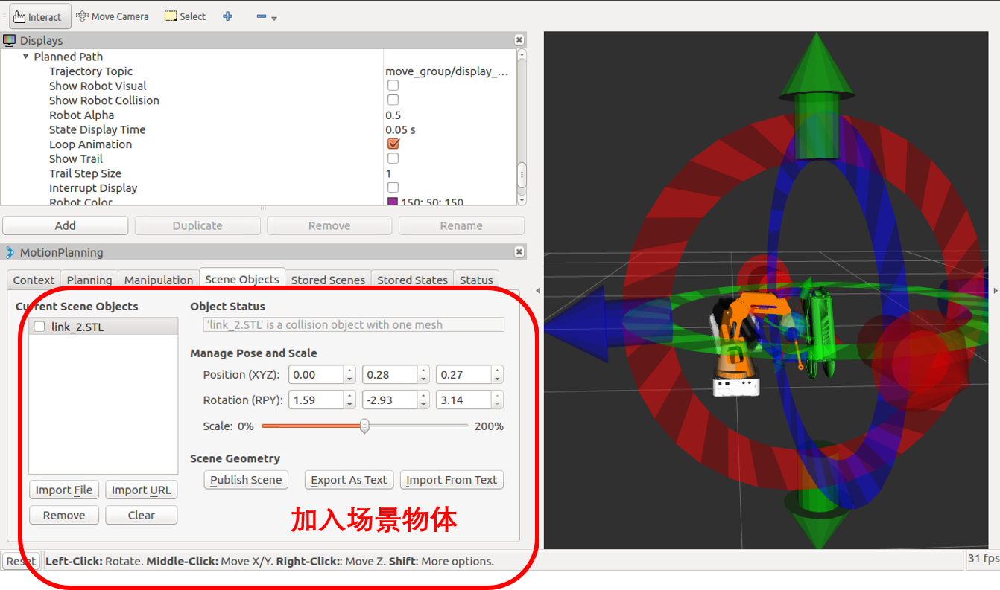

5. 碰撞检测

当机器人的运动场景当中存在一些周围的场景物体的时候，我们可以再次通过鼠标来拖拽机器人，然后让机器人跟场景物体产生冲突，我们可以看到机器人的关节和盘子所接触的这样的一个部分已经变成了红色，就代表着这个部分会发生碰撞，也就是说我们可以通过Moveit去实现这样的碰撞检测功能。

这个时候如果我们再去做运动规划的功能的时候，它会提示运动规划失败，因为它会产生碰撞，所以机器人是不能运用到这个位置的。

6  视频演示

<video src=".\src\video\gui操作演示.mp4"></video>
