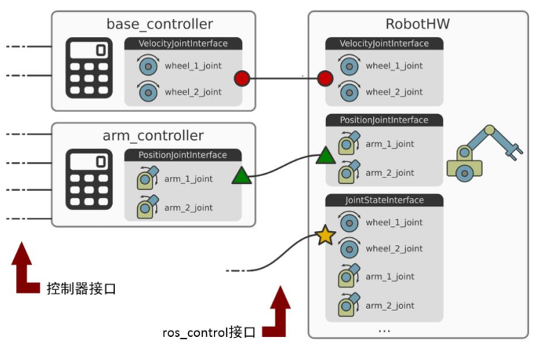
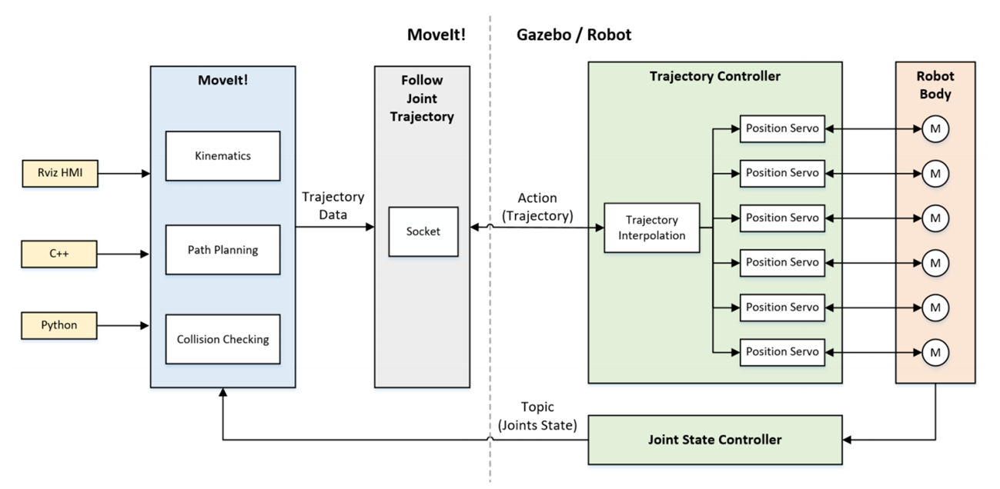
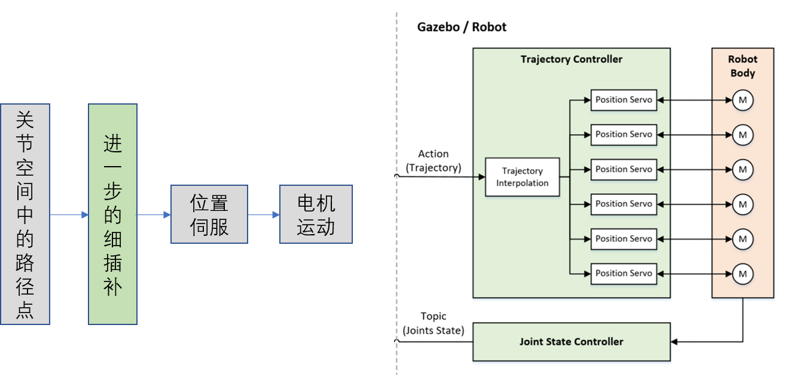
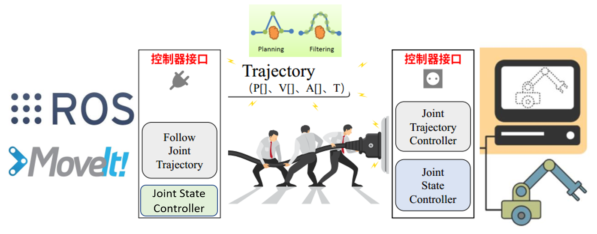
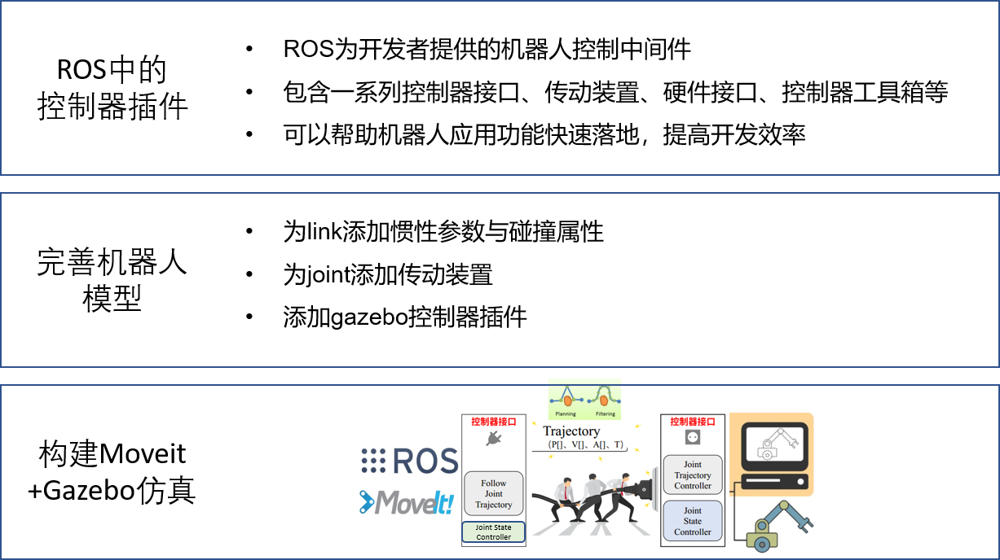

## 7.3 机械臂的Moveit!gazebo仿真

**本讲重点**

- ROS中的控制器插件
- 机械臂URDF模型开发方法
- 构建Moveit!+Gazebo仿真

**教学目的**

- 了解ROS Control框架
- 熟练掌握机械臂URDF模型开发方法
- 熟练掌握机械臂Moveit!+Gazebo仿真的构建方法

上讲我们主要跟大家分享了Moveit setup assistant这样一个可视化的配置工具，配置了我们自己机器人dobot的moveit！并且通过启动demo.launch这个文件，来实现对机械臂的控制。

这讲我们来分享Moveit与gazebo仿真的配置方法，利用moveit驱动一个gazebo仿真中的机器人，因为可能大家在开发或者科研中并不需要一款真实的机械臂，尤其是在算法验证的过程中仿真的作用是非常重要的。那这一讲我们就主要给大家介绍怎么在ROS中搭建一个ROS机械臂的仿真环境。

**目录**

- ROS中的控制器插件
- 完善机器人模型
- 构建Moveit!+Gazebo仿真

### 7.3.1 ROS中的控制器插件

#### 7.3.1.1 ros_control介绍


在ros开发中，如果要将设计的算法、规划结果发给真实机器人并驱动机器人进行运动，往往离不开一个重要的工具——ros_control。

ros_control是ros是用户提供的应用与真实机器人之间的中间件，ros_control提供了一系列控制器接口、传动装置接口、硬件接口、控制器工具箱等等。 它可以帮助机器人应用功能快速落地，提高开发效率。

#### 7.3.1.2 ros中control框架


这张图展示的 ros中 control 的总体框架，我们来介绍其中几个重要的概念：控制器、控制器管理、硬件接口和传动装置；

第一，Controller（控制器）用来实现对joint的控制，并提供了PID等控制器，可以用来请求下层的硬件资源，接受硬件的状态信息，发布控制指令等。

第二，Controller Manager（控制器管理）：程序中往往有多个控制器，控制器管理的主要作用是用来加载、卸载、调用和更新这些控制器。

第三，Hardware Interfaces（硬件接口）：Hardware Interfaces是控制器和硬件之间的桥梁，ros_control通过硬件接口向硬件发送和接受命令，

第四，Transmissions（传动装置）：transmission可以理解成机器人中的传动装置，包括电机和减速器等，用来提供机械臂关节转动时的动力。

#### 7.3.1.3 controllers与ros_control



常见的controller有Joint_effort_controllers、Joint_position_controllers、Joint_velocity_controller、joint_state_controller等几种；

其中，（Joint_effort_controllers用来提供关节运动所需的力/扭矩）、Joint_position_controllers（用来实现一次设置一个或多个关节位置），Joint_velocity_controller（用来实现关节的速度控制）、joint_state_controller（用来读取所有关节位置）

ros_control通过硬件接口向硬件发送和接受命令，常见有Joint Command Interfaces、Joint State Interface等。

### 7.3.2 完善机械臂模型

那么在我们了解了ROS中的Control之后，我们就需要完善我们的机械臂模型，在给他们加上更完善的物理属性的基础上给他们也加上ROS驱动需要的控制器。

#### 7.3.2.1 xacro文件基本介绍

**文件位置：magician/urdf/magician.xacro**

我们在之前的基础课程中已经简单介绍了xacor这种文件，接下来我们就介绍：用xacro制作gazebo模型。之前我们已经介绍了用urdf制作机器人的描述文件并在rviz中进行显示的过程。现在我们需要通过在之前制作好的urdf模型的基础上添加一些必要的物理属性并做一些修改，然后得到能够在Gazebo中显示的机械臂仿真模型。

**第一步**，在.xacro文件顶部引入xacro的命名空间。

```xml
<?xml version="1.0"?>
<robot name="magician"  xmlns:xacro="http://www.ros.org/wiki/xacro">
```

**第二步**，把机械臂模型文件中需要用到的一些属性，如link的质量、长度等，把这些属性定义成常量，方便后面的使用和修改。

```xml
<xacro:property name="PI" value="3.1415926535897931"/>
<xacro:property name="mass" value=“0.00001" />
```

比如我们在后面的文件中需要反复用到圆周率pi，所以我们就把圆周率pi进行了属性定义；之后用到圆周率的话就可以通过“美元符号+花括号+属性名”的方式直接引用，既方便又保证了数值的统一。

**第三步**，引入相关文件。这里引入了 magician.gazebo 和 materials.xacro 两个文件。

```xml
<!-- Import all Gazebo-customization elements, including Gazebo colors -->
<xacro:include filename="$(find magician)/urdf/magician.gazebo" />

<!-- Import colors -->
<xacro:include filename="$(find magician)/urdf/materials.xacro" />
```

其中，在magician.gazebo文件中引入gazebo插件，定义了模型的颜色，摩擦系数等；materials.xacro文件中则定义了一些要用到的颜色的rgbd值。通过这样的方式，我们可以使主要的模型描述文件看起来更加精简，代码的层次结构更加清晰。

#### 7.3.2.3 为Link添加惯性参数与碰撞检测属性

**文件位置：magician/urdf/magician.xacro**

为机械臂添加碰撞属性和惯性参数。gazebo仿真区别于rviz可视化很关键的一点是，gazebo中的模型具有和真实物体一样的物理属性；准确地仿真需要设置物理上合理的物理参数：包括质量，质心位置和所有link的惯性矩阵等因此需要在urdf文件的基础上，为机械臂模型添加碰撞属性和惯性参数。

```xml
<link name="link_1">
    <visual>
        <origin xyz="0 0 0" rpy="0 0 0"/>
        <geometry> 
                 <mesh filename="package:
	//magician/meshes/link_1.dae"/>
        </geometry>
    </visual>

    <collision>
        <origin xyz="0 0 0" rpy="0 0 0"/>
        <geometry>
            <mesh filename="package:
           //magician/meshes/link_1.dae"/>
        </geometry>
    </collision>
    
    
    <inertial>
        <origin xyz="0 0 0" rpy="0 0 0"/>
        <mass value="${mass}" />
        <inertia
            ixx="10" ixy="0.0" ixz="0.0"
            iyy="10" iyz="0.0"
            izz="10"/>
    </inertial>
</link> 
```

这里的碰撞系数，我们直接设置为模型本身，没有对其膨胀。这里我们完全可以去创建一个这个link的碰撞检测模型，并在这里加载。不同形状的物体的惯性矩阵的计算方法不尽相同，因为我们对这些参数要求不高，所以这里不去详细研究如何计算；机械臂的质量和惯性矩阵会对gazebo中的模型的稳定性产生影响，为了使导入gazebo后模型运行会比较稳定，我们用了一个小技巧，就是把link的质量设置得很小而惯性矩阵设置得比较大，在我们对物体的碰撞效果、摩擦、反弹等物理属性要求不高的时候，我们就可以这么做，这也是gazebo仿真中比较常见的一个问题。

#### 7.3.2.4 为joint添加传动装置

**文件位置：magician/urdf/magician.xacro**

真实机械臂的关节通过电机和传动装置实现转动，因此，仿真机械臂中每个关节同样都需要设置transmission传动装置才能够动起来。

```xml
<transmission name="tran1">
      <type>transmission_interface/SimpleTransmission</type>
      <joint name="joint_1">
        <hardwareInterface>hardware_interface/PositionJointInterface</hardwareInterface>
      </joint>
      <actuator name="motor1">
        <hardwareInterface>hardware_interface/PositionJointInterface</hardwareInterface>
        <mechanicalReduction>1</mechanicalReduction>
      </actuator>
    </transmission>

    <transmission name="tran2">
      <type>transmission_interface/SimpleTransmission</type>
      <joint name="joint_2">
        <hardwareInterface>hardware_interface/PositionJointInterface</hardwareInterface>
      </joint>
      <actuator name="motor2">
        <hardwareInterface>hardware_interface/PositionJointInterface</hardwareInterface>
        <mechanicalReduction>1</mechanicalReduction>
      </actuator>
    </transmission>

    <transmission name="tran3">
      <type>transmission_interface/SimpleTransmission</type>
      <joint name="joint_5">
        <hardwareInterface>hardware_interface/PositionJointInterface</hardwareInterface>
      </joint>
      <actuator name="motor3">
        <hardwareInterface>hardware_interface/PositionJointInterface</hardwareInterface>
        <mechanicalReduction>1</mechanicalReduction>
      </actuator>
    </transmission>
```

这里，我们把机械臂连杆部分的硬件接口类型设置为PositionJointInterface，把电机的减速比设为"1“

#### 7.3.2.5 添加gazebo控制器插件

**文件位置：magician/urdf/magician.gazebo**

为joint设置好传动装置后，要控制电机的运动还需要添加gazebo控制器插件——gazebo_ros_control它的功能类似真实机器人中的伺服控制器，能够实现pid等控制；

```xml
<!-- ros_control plugin -->
  <gazebo>
    <plugin name="gazebo_ros_control" filename="libgazebo_ros_control.so">
      <robotNamespace>/magician</robotNamespace>
      <robotSimType>gazebo_ros_control/DefaultRobotHWSim</robotSimType>
    </plugin>
  </gazebo>
```

Gazebo控制器插件可以设置的参数有很多，这里对几个主要参数进行了设置：robotNamespace：机器人命名空间，把它设置为机械臂的名称，当有多个机器人时方便区分。robotSimType：机器人仿真类型，用来完成上层下发到机器人模型的命令的转换，这里选择了默认的机器人硬件抽象层接口。

#### 7.3.2.6 在gazebo中加载机器人模型

**文件位置： magician/launch/arm_bringup_gazebo.launch**

接下来，要通过launch文件在gazebo中加载机械臂模型。

```
<launch>
    <!-- Load the URDF into the ROS Parameter Server -->
    <param name="robot_description" command="$(find xacro)/xacro –inorder
	 '$(find magician)/urdf/magician.xacro'" />
    
    <!-- Launch Gazebo  -->
    <include file="$(find magician)/launch/arm_world.launch" />
</launch>
```

首先，将刚才编写的xacro模型文件的路径保存到robot_description参数中，并加载到ros参数服务器中；然后，引入arm_world.launch文件；

**arm_world.launch文件**（**文件位置： magician/launch/arm_world.launch**）

```xml
<launch>
  <arg name="paused" default="false"/>
  <arg name="use_sim_time" default="true"/>
  <arg name="gui" default="true"/>
  <arg name="headless" default="false"/>
  <arg name="debug" default="false"/>

  <!-- We resume the logic in empty_world.launch -->
  <include file="$(find gazebo_ros)/launch/empty_world.launch">
    <arg name="world_name" value="$(find magician)/worlds/obj.world"/>
    <arg name="debug" value="$(arg debug)" />
    <arg name="gui" value="$(arg gui)" />
    <arg name="paused" value="$(arg paused)"/>
    <arg name="use_sim_time" value="$(arg use_sim_time)"/>
    <arg name="headless" value="$(arg headless)"/>
  </include>

  <!-- Run a python script to the send a service call to gazebo_ros to spawn a URDF robot -->
  <node name="urdf_spawner" pkg="gazebo_ros" type="spawn_model" respawn="false"  output="screen“ args="-urdf -model arm -param robot_description"/>
</launch>

```

在arm_world.launch文件中，首先启动了gazebo仿真环境并设置了一些相关的参数；然后调用gazebo_ros功能包中的spawn_model节点，根据robot_description参数对应的模型文件产生模型，并放到gazebo仿真环境中进行显示。

### 7.3.3 构建Moveit!+Gazebo仿真

这样呢我们就完善了我们的模型，那有个完整的模型我们还要让模型动起来，而且是通过moveit驱动动起来。所以下面我们就再来介绍怎么样才能吧Moveit与azebo仿真连接起来。

#### 7.3.3.1 Moveit!机器人控制框架



这里我们首先了解一下moveit机器人控制框架。

左边是Moveit端，右边是机器人端 可以使Gazebo仿真也可以是真实的机器人。两边以虚线为边界。Moveit端的Follow Joint Trajectory控制器接口以action方式发送 Trajectory Data 给Gazebo或者真实的机器人。同时他也会以Joint  state controller的形式接受机器人端的信息，来读取当前机器人的真实状态。

 **Moveit!端介绍**


我们仔细了解一下moveit端：首先通过在rviz界面设置或通过C++/Python接口调用Moveit!中的路径规划等相关功能  对机械臂进行规划，如果规划成功，Moveit!会输出规划数据（包括关节角序列和加速度序列等信息），也就是这里的Trajectory Data这样的一个数据，我们可以叫做关节空间中的路径点。然后通过Follow Joint Trajectory控制器接口 以action方式发送给Gazebo或者真实的机器人，



Gazebo中的模型或者真实机械臂就会根据这些关节空间的路径点，先进行一个细插补，然后进行位置伺服来驱动电机运动，同时将机器人的状态数据反馈回Moveit!确认机器人是否达到目标位置，形成闭环控制。

#### 7.3.3.2 Moveit!+Gazebo仿真框架



那如果我们用的是gazebo仿真那我们的框架就可以形象的表示成上图的样子。为什么两端的控制器接口都有Joint State Controller呢，我们在仔细看之前的框架，因为在moveit端是完全可以接受机器人端发送的Joint State Controller信息。所以它也一定有Joint State Controller接口。那么为了让两端连通，我们就要正确配置两端的控制器接口。

两端的插件接口中间通过action 这样的交互接口来进行通讯，两端的action一定要保持一致。另外一点就是编写插件的套路，首先需要去编写一个配置文件，然后去编写一个launch文件，启动控制器插件节点，并且加载这里的配置文件。

#### 7.3.3.3 Moveit!配置

**配置文件**

在arm_gripper_moveit_config/config/controllers.yaml中设置与Gazebo对应的控制器接口：

```
controller_manager_ns: controller_manager
joint_state_controller:
    type: joint_state_controller/JointStateController
    publish_rate: 50
controller_list:
  - name: magician/joint1_position_controller
    action_ns: follow_joint_trajectory
    type: FollowJointTrajectory
    default: true
    joints:
      - joint_1
```

刚刚我们说了，要实现Moveit!+Gazebo仿真，还需要在机械臂的Moveit!端设置和gazebo中对应的的控制器接口。主要是来监控机器人的实时状态.我们先来Moveit！端的，需要设置  joint_state_controller 与 follow_joint_trajectory 。在我们的配置文件中，会设置joint_state_controller的类型，也就是这里的 JointStateController，这里面我们会列出每个关节，设置状态的发不频率为50hz。

**启动文件**

在dobot_moveit_config/config/magician_moveit_controller_manager.launch.xml中加载controllers.yaml：

```
<!-- load controller_list -->
<rosparam file="$(find arm_gripper_moveit_config)/config/controllers.yaml"/>
```

这里会在dobot_moveit_config这个包里 的magician_moveit_controller_manager.launch.xml
文件中加载刚才的controllers.yaml文件，并把所有的参数加载到参数服务器中。

#### 7.3.3.4 gazebo端配置

**配置文件**

**文件位置：\magician\magician_control\config**

为每个joint添加controller

```
#命名空间
magician:
  # Publish all joint states -----------------------------------
  joint_state_controller:
    type: joint_state_controller/JointStateController
    publish_rate: 50  
  
  # Position Controllers ---------------------------------------
  joint1_position_controller:
    type: position_controllers/JointTrajectoryController
    joints:
      - joint_1
    gains:
      joint_1:   {p: 100.0, i: 0.0, d: 0.1, i_clamp: 0.0}
```

在gazebo端我们 需要设置  joint_state_controller 与 Joint_Trajectory_Controller                                
首先，设置joint_state_controller，用来监控机器人的实时状态，并把发布频率设成50赫兹，实现以1秒50次的频率发布关节状态；然后，为每个joint设置相应的JointTrajectoryControlle，用来接收指令并传给joint对应的传动装置，从而控制joint的运动；这里要注意的是，joints后面填的关节名称要和xacro文件中的保持一致；同时，还需要设置闭环控制中的pid参数。这里的PID参数完全满足我们仿真的需要，但是如果我们的对象是实际的机械臂的话，pid参数是要根据实际情况其调整的。

**启动文件**

**文件位置：\magician\magician_control\launch\arm_gazebo_states.launch**

```xml
<launch>
  <!-- Load joint controller configurations from YAML file to parameter server -->
  <rosparam file="$(find magician)/magician_control/config/myrobot_control.yaml" command="load"/>
  
    <!-- load the controllers -->
  <node name="controller_spawner" pkg="controller_manager" type="spawner" respawn="false"
        output="screen" ns="/magician" args="joint_state_controller
        joint1_position_controller  joint2_position_controller joint5_position_controller
        joint6_position_controller joint_zhijia_position_controller
        joint_jiazi_1_position_controller  joint_jiazi_2_position_controller" />

  <!-- convert joint states to TF transforms for rviz, etc -->
  <node name="robot_state_publisher" pkg="robot_state_publisher" type="robot_state_publisher"
       respawn="false" output="screen">
       <remap from="/joint_states" to="/magician/joint_states" />
  </node>
</launch>
```

最后，在\magician\magician_control\launch\arm_gazebo_states.launch路径下的

launch文件中将上述的yaml文件加载到参数服务器中。此外，这个launch文件还 调用controller_manager包 根据参数文件内容启动相应的controller，同时将关节状态转换为TF变换并发布。至此，Moveit+Gazebo仿真环境就搭建好了。

#### 7.3.3.5 Moveit!+gazebo启动文件配置

```
<!-- moveit launch file -->
    <include file="$(find 	dobot_moveit_config)/launch/moveit_planning_execution.launch" />
```

最后，为了方便启动，在magician/launch/arm_bringup_gazebo.launch中加载Moveit!的启动文件： dobot_moveit_config包里的moveit_planning_execution.launch文件。那到这里我们的启动文件也就配置完了，启动这个launch文件，就可以同时启动Moveit！与gazebo了。我们再来一起看一下 这个启动文件都启动了什么。

**文件位置：magician/launch/arm_bringup_gazebo.launch**

```xml
<launch>
    <!-- Load the URDF into the ROS Parameter Server -->
    <param name="robot_description" command="$(find xacro)/xacro –inorder
	 '$(find magician)/urdf/magician.xacro'" />
    <!-- Launch Gazebo  -->
    <include file="$(find magician)/launch/arm_world.launch" />
</launch>
 <!– ros_control trajectory control dof arm launch file  -->
    <include file="$(find magician)/launch/arm_gazebo_states.launch" />
</launch>
<!-- moveit launch file -->
    <include file="$(find	dobot_moveit_config)/launch/moveit_planning_execution.launch" />
```

首先是加载了 我们完善了的机械臂模型文件magician.xacro。然后是启动了一个空白的gazebo仿真环境，当然也加载了一些参数到参数服务器中，我们之前也看过这个arm_world.launch文件了。接着又启动了配置好控制接口的gazebo启动文件。最后也就是我上一页ppt添加的东西，启动了Moveit！的各种节点。

#### 7.3.3.6 视频演示

当然在启动之前，需要编译一下。

编译成功之后 运行$  roslaunch magician arm_bringup_gazebo.launch  就可以同时启动moveit与gazebo了。我们来看一下我们的演示视频

<video src=".\src\video\dobot1.mp4"></video>
运行$  roslaunch magician arm_pen_gazebo.launch  就可以同时启动moveit与gazebo了

<video src=".\src\video\arm_pen.mp4"></video>
运行$  roslaunch magician arm_gripper_gazebo.launch  就可以同时启动moveit与gazebo了

<video src=".\src\video\arm_gripper.mp4"></video>
### 7.3.4 小结



本节课我们学习了构建moveit!与gazebo仿真环境的流程。主要分为三个部分来给大家介绍：

1. ROS中的控制器插件：ros_control是ros为用户提供的应用与真实机器人之间的中间件，ros_control提供了一系列控制器接口、传动装置接口、硬件接口、控制器工具箱等等。 它可以帮助机器人应用功能快速落地，提高开发效率。

2. 完善机械臂模型：首先要给link添加惯性参数与碰撞属性，然后为joint添加传动装置，最后是添加gazebo控制器插件。

3. 构建Moveit!+gazebo仿真：我们从框架的两端分别给大家介绍。先介绍了moveit端的接口的配置与启动文件的配置，然后介绍了gazebo端的接口配置与配置文件的配置。最后我们最终完成了我们的Moveit!+gazebo启动文件的配置。