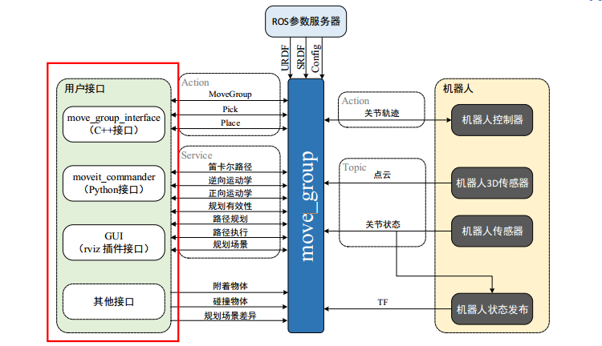
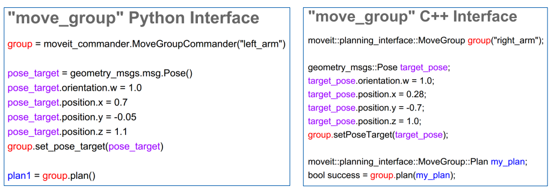
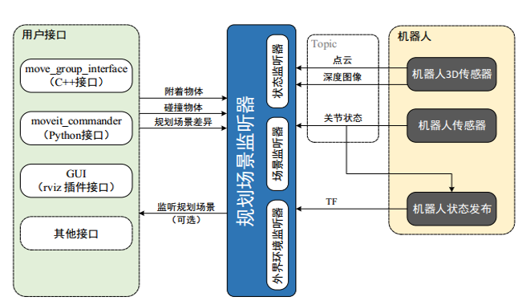
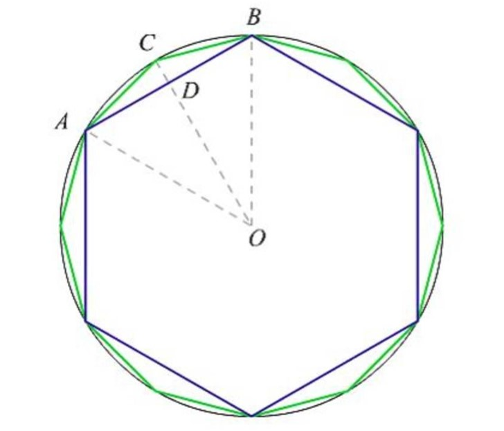

## 9.4 moveit python 编程

**本讲重点**

- Moveit!编程控制机械臂运动
- Moveit!实现机械臂关节空间规划
- Moveit!实现机械臂笛卡尔空间规划
- Moveit!实现机械臂避障路径规划
- Moveit!实现机械臂圆弧规划

**教学目的**

- 熟练掌握Moveit通过编程控制机械臂运动编程方法
- 熟练掌握Moveit!实现机械臂关节空间规划编程方法
- 熟练掌握Moveit!实现机械臂笛卡尔空间规划编程方法
- 熟练掌握Moveit!实现机械臂避障路径规划编程方法
- 熟练掌握Moveit!实现机械臂圆弧规划编程方法

前两讲我们已经对moveit的gui以及仿真环境有了大概的了解，本讲我们就来学习Moveit的python编程。首先我们要了解Moveit是怎样通过编程控制机械臂运动的然后我们就利用moveit编程来实现，机械臂的关节空间规划、笛卡尔空间规划、避障路径规划以及圆弧规划。但是其实这些路径规划实现的本质都还是机械臂的关节空间规划与笛卡尔空间规划。每部分呢我们都对通过规划方法的概念、代码详解、例程演示来跟大家分享。

下面我们来看具体的内容。

### 1. Moveit!编程控制机械臂运动

#### 1.1 Moveit!框架回顾



我们再来回顾一下这张图，moveit提供的用户接口主要有C++接口、Python接口、GUI接口。之前我们所讲的所有操作都是在GUI里面进行的，包括拖拽、规划、执行、以及添加其他物体都是在rviz这样一个可视化界面里进行的。

接下来我们就是来利用Moveit提供给我们的编程接口对机器人进行控制

#### 1.2 Moveit!编程接口



这两幅图呢是moveit给我们提供的c++以及python接口。在接下来的内容中我们是以python接口为例  跟大家分享。因为python在代码形式上更加清晰，易懂。但是不管使用python还是c++，它的流程都是一样的。

ppt中代码的含义我们会在下面的例程中给大家具体解释。那我们就来看具体的编程实例：机械臂的关节空间规划

### 2. Moveit！实现机械臂关节空间规划

关节空间规划是以关节角度的函数来描述机器人的轨迹，不必在直角坐标系中描述两个路径点之间的形状，计算简单，容易。再者由于关节空间与直角空间之间并不是连续的对应关系，因为也不会发生机构的奇异性问题。

#### 2.1 机械臂关节空间规划理论

在关节空间中进行轨迹规划时，需要给定机械臂的起始构形与终止构形，然后对关节进行插值。


在机械臂运动的过程中，由于对应起始位置的关节角度theta是已知的（无论是仿真还是真实的机械臂都可以得到当前位置的关节角度）。而终止位置的关节角度可以通过设定的得到，如果设定为终止位置的位姿，那么可以通过运动学反解得到，Moveit！中也针对这两种不同的情况给出了不同的接口函数。因此我们可以通过起始关节角度与终止关节角度的一个平滑的插值函数来表示运动轨迹。 我们来看下面这张图，theta（t）在时刻t=0时的起始关节角度为theta（0），在t=f时的值为终止关节角度theta（f），显然有很多平滑的函数可以作为关节插值函数。

那么哪一个插值函数最平稳呢？我们来看接下来的内容。

为了实现单个关节的平稳运动，轨迹函数theta（t），至少要满足四个约束条件，其中两个约束条件是起始点与终止点的关节角度：

为了满足关节运动的连续性要求，另外还有两个约束条件，那就是在起始点与终止点的关节速度要求。v（0）=0;v(f)=0,也就是起始位置与终止位置的关节速度都为0。


以上四个边界条件唯一确定一个三次多项式，后面也就是每个系数的值。如果根据这个三次多项式插值，可以保障关节运动的速度是连续的平稳的。


但是如果我们对这个多项式求导，会发现在tf时刻，角加速度并不为零。所以它的角加速度并不是平稳的。如果对机械臂的运动轨迹要求更为严格，那么约束条件就增多了，三次多项式就不能满足了，必须要更高阶的多项式对运动轨迹进行插值。例如对起始点与终止点都规定了关节位置、速度、加速度，那么就需要一个五次多项式进行插值。大家有兴趣的可以在课后自己去推导联系，我们关于关节空间规划的理论部分就介绍到这里。

接下来我们来看moveit的编程实现

#### 2.2 机械臂关节空间规划(fk 正运动学)代码实现

这里我们先针对输入为目标关节角度的正运动学关节空间规划进行介绍，当然后面也会有输入为目标位姿的关节空间规划方法的相关介绍。

接下来我们通过代码实现机械臂运动到我们设定的目标构型（关节角度）。

文件位置：dobot_ws\dobot_planning\scripts\fk_demo.py

```python
#!/usr/bin/env python
# -*- coding: utf-8 -*-

import rospy, sys
import moveit_commander

class MoveItFkDemo:
    def __init__(self):
        # 初始化move_group的API
        moveit_commander.roscpp_initialize(sys.argv)
        
        # 初始化ROS节点
        rospy.init_node('fk_demo', anonymous=True)
        
        # 初始化需要使用move group控制的机械臂中的arm group
        arm = moveit_commander.MoveGroupCommander('arm')
        
        # 机械臂关节最大速度与最大加速度设置
        arm.set_max_velocity_scaling_factor(0.3)
        arm.set_max_acceleration_scaling_factor(0.3)
        
        # 设置机械臂的允许误差值
        arm.set_goal_joint_tolerance(0.001)

        # 控制机械臂先回到“up”位置
        arm.set_named_target('up')
        arm.go()
        rospy.sleep(2)
        
        # 设置机械臂的目标位置，使用关节位置数据进行描述（单位：弧度）
        joint_positions = [0,1.06, 1.57, 0.71,0]
        arm.set_joint_value_target(joint_positions) 
        # 控制机械臂完成运动
        arm.go()
        rospy.sleep(1) 
        
         # 控制机械臂回到“up”位置
        arm.set_named_target('up')
        arm.go()
        rospy.sleep(2)
        
        # 关闭并退出moveit
        moveit_commander.roscpp_shutdown()
        moveit_commander.os._exit(0)

if __name__ == "__main__":
    try:
        MoveItFkDemo()
    except rospy.ROSInterruptException:
        pass
```

下面分析代码的详细实现流程：

```python
import moveit_commander
```

使用MoveIt！的API之前，需要-
导入其python接口模块moveit_commander。

```python
moveit_commander.roscpp_initialize(sys.argv)
```

使用MoveIt！的python的API之前，先对API进行初始化，初始化的底层依然使用的是roscpp接口，只是做了python封装。

```python
arm = moveit_commander.MoveGroupCommander('arm')
```

在moveit_commander中提供了一个重要的类——MoveGroupCommander，可以创建针对规划组的控制对象，这里创建了”dobot“作为控制对象。

```python
arm.set_max_velocity_scaling_factor(0.3)
arm.set_max_acceleration_scaling_factor(0.3)
```

这两行设置的时机械臂运动的最大速度与最大加速度限制

```python
 arm.set_goal_joint_tolerance(0.001)
```

这里是设置机械臂运动控制的允许误差，因为是在关节空间下的运动，所以需要设置关节运动的允许误差，这里设为0.001rad。也就是说，机器人各轴运动到目标位置的0.001rad的范围内即认为到达目标位置。

```python
    arm.set_named_target('up')
    arm.go()
    rospy.sleep(2)
```

set_named_target节课可设置SRDF文件中（也就是在Setup Assistant中设定）的位姿，这里设为”up“，然后使用go()命令，让机器人规划并运动到”up“。最后保持一段时间的延时，以确保机器人完成运动。可以通过查看topic 、joint_state来获得目标构型：$ rostopic echo /joint_state

```python
    joint_positions = [0,1.06, 1.57, 0.71,0]
    arm.set_joint_value_target(joint_positions)
    arm.go()
    rospy.sleep(1)
```

使用set_joint_value_target（）设置目标构形即机械臂各个关节的弧度。然后使用go()控制机器人完成运动。

```python
    moveit_commander.roscpp_shutdown()
    moveit_commander.os._exit(0)
```

完成运动之后关闭接口，退出程序。

#### 2.3 机械臂关节空间规划(fk)运行效果

1. 首先我们来启动Moveit与dobot所需的各种节点，运行

`roslaunch dobot_moveit_config demo.launch`

2. 然后运行关节空间规划的.py文件

`rosrun dobot_planning fk_demo.py`

运行效果视频所示：

<video src=".\src\video\媒体1.mp4"></video>
#### 2.4 机械臂关节空间规划(fk正运动学)gazebo仿真

#### 2.5  机械臂关节空间规划(ik逆运动学)代码实现

我们上面的例程给出的目标状态的输入为关节角度，如果输入为目标位姿，也可以通过运动学逆解求得目标关节角度，当然MoveIt！也提供了输入为目标位姿的关节空间规划接口，下面我们就来看如何通过python编程实现输入为目标位姿的关节空间规划。

文件位置：dobot_ws\dobot_planning\scripts\ik_demo.py

```python
import rospy, sys
import moveit_commander
from moveit_msgs.msg import RobotTrajectory
from trajectory_msgs.msg import JointTrajectoryPoint
from geometry_msgs.msg import PoseStamped, Pose
from tf.transformations import euler_from_quaternion, quaternion_from_euler

class MoveItIkDemo:
    def __init__(self):
        # 初始化move_group的API
        moveit_commander.roscpp_initialize(sys.argv)
        
        # 初始化ROS节点
        rospy.init_node('moveit_ik_demo')
                
        # 初始化需要使用move group控制的机械臂中的arm group
        arm = moveit_commander.MoveGroupCommander('arm')
                
        # 获取终端link的名称
        end_effector_link = arm.get_end_effector_link()
        rospy.loginfo(end_effector_link) 
        
        # 设置目标位置所使用的参考坐标系
        reference_frame = 'base_link'
        arm.set_pose_reference_frame(reference_frame)  
        
        # 当运动规划失败后，允许重新规划
        arm.allow_replanning(True)
        
        # 设置位置(单位：米)和姿态（单位：弧度）的允许误差
        arm.set_goal_position_tolerance(0.01)
        arm.set_goal_orientation_tolerance(0.05)
        
        # 控制机械臂先回到初始化位置
        arm.set_named_target('up')
        arm.go()
        rospy.sleep(2)
               
        # 设置机械臂工作空间中的目标位姿，位置使用x、y、z坐标描述，
        # 姿态使用四元数描述，基于base_link坐标系
        target_pose = PoseStamped()
        target_pose.header.frame_id = reference_frame
        target_pose.header.stamp = rospy.Time.now()     
        target_pose.pose.position.x = -0.064
        target_pose.pose.position.y = 0.186
        target_pose.pose.position.z = -0.012
        target_pose.pose.orientation.x = 0.957
        target_pose.pose.orientation.y = 0.292
        target_pose.pose.orientation.z = 0
        target_pose.pose.orientation.w = 0
        # 设置机器臂当前的状态作为运动初始状态
        arm.set_start_state_to_current_state()
        # 设置机械臂终端运动的目标位姿
        arm.set_pose_target(target_pose, end_effector_link)
        # 规划运动路径
        traj = arm.plan()
        # 按照规划的运动路径控制机械臂运动
        arm.execute(traj)
        rospy.sleep(1)
    
        # 控制机械臂回到初始化位置
        arm.set_named_target('up')
        arm.go()

        # 关闭并退出moveit
        moveit_commander.roscpp_shutdown()
        moveit_commander.os._exit(0)

if __name__ == "__main__":
    MoveItIkDemo()
```

以上例程中的代码与前面输入为关节角度的关节空间规划有很多重复，我们就简单说一下：初始化move_group的API; 初始化ROS节点;初始化需要使用move group控制的机械臂中的arm group;获取终端link的名称;

设置目标位置所使用的参考坐标系;因为工作空间的位姿需要使用笛卡尔坐标值进行描述，所以必须声明该位姿所在的坐标系。

```python
   reference_frame = 'base_link'
   arm.set_pose_reference_frame(reference_frame)
```

当运动规划失败后，允许重新规划，由于机械臂运动学反解存在无解或者多解的情况，其中有些情况无法实现运动规划，这种情况下允许重新规划，可能会获得合理的运动规划结果。如果设置为true，MoveIt！会尝试求解五次，否则只会求解一次。

```python
    arm.allow_replanning(True)
```

这里使用PostStamped消息数据描述机器人的目标位姿。首先设置位姿所在的参考坐标系，然后创建时间戳，接着设置目标位姿的三维坐标x y z与四元数。可以通过tf之间关系来看末端位姿：$ rosrun tf tf_echo base_link link_7

```python
    target_pose = PoseStamped()
    target_pose.header.frame_id = reference_frame
    target_pose.header.stamp = rospy.Time.now()     
    target_pose.pose.position.x = -0.064
    target_pose.pose.position.y = 0.186
    target_pose.pose.position.z = -0.012
    target_pose.pose.orientation.x = 0.957
    target_pose.pose.orientation.y = 0.292
    target_pose.pose.orientation.z = 0
    target_pose.pose.orientation.w = 0
```


在输入目标位姿前，需要设置机器人的初始状态，set_start_state_to_current_state这个接口设置当前状态作为起始状态。然后使用set_pose_target（）设置在参考坐标系下的目标位姿。

```python
    arm.set_start_state_to_current_state()
    arm.set_pose_target(target_pose, end_effector_link)
```

运动规划的第一步是规划路径，使用plan（）完成，规划成功后会返回一条规划好的运动轨迹;然后execute（）会控制机器人沿着轨迹完成运动。如果规划失败，则会根据设置，重新进行规划。

```python
    # 规划运动路径
    traj = arm.plan()
    # 按照规划的运动路径控制机械臂运动
    arm.execute(traj)
```

#### 2.6 机械臂关节空间规划(ik)运行效果

1. 首先我们来启动Moveit与dobot所需的各种节点，运行

`roslaunch dobot_moveit_config demo.launch`

2. 然后运行关节空间规划的.py文件

`rosrun dobot_planning ik_demo.py`

运行效果如视频所示：

<video src=".\src\video\媒体2.mp4"></video>
#### 2.7 机械臂关节空间规划gazebo仿真

### 3. Moveit!实现机械臂笛卡尔空间规划

机械臂关节空间的规划不需要考虑机械臂末端的姿态，而机械臂的作业一般都时通过机械臂末端的位姿的笛卡尔坐标的节点序列规定的，这里的节点指的是机械臂末端的齐次变换矩阵，每个节点都是由工具坐标系相对于作业坐标系的齐次变换矩阵来描述。相应的关节变量可通过运动学逆解来计算。

#### 3.1 机械臂笛卡尔空间规划理论

那么如何才能实现机器人的末端做一段直线运动呢？我们已经知道机械臂末端的位姿可以用一系列的节点pi来表示，因此，在直角坐标中实现直线运动的首要问题就是，如何在路径的起点与终点之间生成一系列的中间点。两点之间最简单的运动就是在空间的直线运动与绕轴的转动，如果给定运动时间，那么就可以在两点之间生成一个使线速度与角速度都受控的运动。


我们来看一个一般情况下的图，由pi到pi+1,就相当于一个坐标系有i变换到i+1,那我们来看，这个变化的过程，可以分解为一个直线（这里我们要求的是两点之间的直线运动）的移动和一个坐标系的旋转变化。

#### 3.2 机械臂笛卡尔空间规划代码实现

接下来我们就通过代码实现机械臂的直线运动。

文件位置：dobot_ws\dobot_planning\scripts\cartisian_demo.py

```python
#!/usr/bin/env python
# -*- coding: utf-8 -*-

import rospy, sys
import moveit_commander
from moveit_commander import MoveGroupCommander
from geometry_msgs.msg import Pose
from copy import deepcopy

class MoveItCartesianDemo:
    def __init__(self):
        # 初始化move_group的API
        moveit_commander.roscpp_initialize(sys.argv)

        # 初始化ROS节点
        rospy.init_node('moveit_cartesian_demo', anonymous=True)
        
        # 是否需要使用笛卡尔空间的运动规划
        cartesian = rospy.get_param('~cartesian', True)
                        
        # 初始化需要使用move group控制的机械臂中的arm group
        arm = MoveGroupCommander('arm')
        
        # 当运动规划失败后，允许重新规划
        arm.allow_replanning(True)
        
        # 设置目标位置所使用的参考坐标系
        arm.set_pose_reference_frame('base_link')
                
        # 设置位置(单位：米)和姿态（单位：弧度）的允许误差
        arm.set_goal_position_tolerance(0.01)
        arm.set_goal_orientation_tolerance(0.1)
        
        # 获取终端link的名称
        end_effector_link = arm.get_end_effector_link()
                                        
        # 控制机械臂运动到之前设置的“up”姿态
        arm.set_named_target('up')
        arm.go()
        
        # 获取当前位姿数据作为机械臂运动的起始位姿
        start_pose = arm.get_current_pose(end_effector_link).pose
                
        # 初始化路点列表
        waypoints = []        
        # 将初始位姿加入路点列表
        if cartesian:
            waypoints.append(start_pose)
            
        # 设置第二个路点数据，并加入路点列表
        # 第二个路点需要向前运动0.094米，向下运动0.042米
        wpose = deepcopy(start_pose)
        wpose.position.y += 0.094
        wpose.position.z -= 0.042
        
        if cartesian:
            waypoints.append(deepcopy(wpose))
        else:
            arm.set_pose_target(wpose)
            arm.go()
            rospy.sleep(1)
           
        # 设置第三个路点数据，回到初始位置，并加入路点列表
        if cartesian:
            waypoints.append(deepcopy(start_pose))
        else:
            arm.set_pose_target(start_pose)
            arm.go()
            rospy.sleep(1)
            
        if cartesian:
            fraction = 0.0   #路径规划覆盖率
            maxtries = 300   #最大尝试规划次数
            attempts = 0     #已经尝试规划次数
     
            # 尝试规划一条笛卡尔空间下的路径，依次通过所有路点
            while fraction < 1.0 and attempts < maxtries:
                (plan, fraction) = arm.compute_cartesian_path (
                                        waypoints,   # waypoint poses，路点列表
                                        0.01,        # eef_step，终端步进值
                                        0.0,         # jump_threshold，跳跃阈值
                                        True)        # avoid_collisions，避障规划
                
                # 尝试次数累加
                attempts += 1
                
                # 打印运动规划进程
                if attempts % 10 == 0:
                    rospy.loginfo("Still trying after " + str(attempts) + " attempts...")
                         
            # 如果路径规划成功（覆盖率100%）,则开始控制机械臂运动
            if fraction == 1.0:
                rospy.loginfo("Path computed successfully. Moving the arm.")
                arm.execute(plan)
                rospy.loginfo("Path execution complete.")
            # 如果路径规划失败，则打印失败信息
            else:
                rospy.loginfo("Path planning failed with only " + str(fraction) + " success after " + str(maxtries) + " attempts.")  
        
        # 关闭并退出moveit
        moveit_commander.roscpp_shutdown()
        moveit_commander.os._exit(0)

if __name__ == "__main__":
    try:
        MoveItCartesianDemo()
    except rospy.ROSInterruptException:
        pass
```

1.与之前的例程有很多的相同的地方我们就不做过多介绍，这里主要介绍一下笛卡尔空间规划的部分。首先要将笛卡尔空间规划的使能参数置为true：

```
 cartesian = rospy.get_param('~cartesian', True)
```

2.在笛卡尔空间规划中多了一些特有的概念，首先是“waypoints”也就是路点。“waypoints”是一个路点列表，笛卡尔路径需要经过每一个路点，相邻路点之间通过直线轨迹运动。那怎么把路点加入路点列表中呢？代码如下：

```
    #初始化路点列表
    waypoints = []          
    # 将初始位姿加入路点列表
    if cartesian:
        waypoints.append(start_pose)
```

3.接下来是笛卡尔空间规划的API——compute_cartesion_path(),共有四个参数，第一个参数就是之前创建的路点列表;第二个参数是终端步进指；第三个参数是跳跃阈值，第四个参数设置运动过程中是否考虑避障。

```python
 	while fraction < 1.0 and attempts < maxtries:
                (plan, fraction) = arm.compute_cartesian_path (
                                        waypoints,   # waypoint poses，路点列表
                                        0.01,        # eef_step，终端步进值
                                        0.0,         # jump_threshold，跳跃阈值
                                        True)        # avoid_collisions，避障规划
```

4.compute_cartesion_path（）执行之后有两个返回值，plan是规划出来的运动轨迹，fraction用于描述规划成功的轨迹在给定路点列表的覆盖率，从0到1。如果小于1,说明给定的路点列表无法完整规划，这种情况可以重新进行规划，但是需要人为设置规划次数。

5.如果规划成功，fraction的值为1,此时就可以使用execute（）控制机器人执行规划成功的路径轨迹了。

```python
	if fraction == 1.0:
                rospy.loginfo("Path computed successfully. Moving the arm.")
                arm.execute(plan)
                rospy.loginfo("Path execution complete.")
```

这个例程让主要是希望大家了解compute_cartesion_path（）这个API的使用方法，可以帮助我们实现一系列路点之间的笛卡尔直线规划。

#### 3.3  机械臂笛卡尔空间规划运行效果

1. 首先我们来启动Moveit与dobot所需的各种节点，运行

`$ roslaunch dobot_moveit_config demo.launch`

2. 然后运行笛卡尔空间规划的.py文件

`$ rosrun dobot_planning cartesian_demo.py`

运行成功之后我们可以看到在rviz界面中dobot先来到了配置Moveit时生成的“up“位置，然后在运动到我们通过关节角度设定的目标位置 ，最后再回到”up“位置。效果如视频所示。

<video src=".\src\video\媒体3.mp4"></video>
#### 3.4 机械臂笛卡尔空间规划gazebo仿真

###  4. Moveit!实现机械臂避障路径规划

接下来我们会给大家在上面介绍的关节空间规划与笛卡尔空间规划的基础上再给大家分享两种路径规划。下面的内容我们会在现在比较常见的UR5机械臂上进行。关于UR5及其功能包的我们这里就不做过多的介绍了。我们先来看机械臂的避障路径规划理论

####  7.4.4.1 机械臂避障路径规划理论



在moveit里面它是可以实时的检测外界的障碍，并且在规划plan的时候自主绕过障碍。Moveit提供了规划场景监听器，他就是用来检测场景里面是不是有障碍物的，那这个障碍物是怎么加进来的呢？

1.在之前操作界面的介绍中我们已经介绍了一种通过rviz添加其他物体的方法。

2.那么还有一种方法就是通过程序来添加物体。

3.其实除了给场景中添加物体，也可以通过外部传感器获得外部信息，然后将检测结果加入到Moveit规划中来。

那下面呢我们就通过编程给场景中添加物体，并实现机械臂的避障路径规划。

####  4.2 机械臂避障路径规划理论
 机械臂避障路径规划代码实现

接下来，我们要做一个代码添加障碍物并且实现机械臂避障的路径规划。

文件位置：dobot_ws\ur5_planning\scripts\\obstancles_demo.py

```python
import rospy, sys
import moveit_commander

from moveit_commander import MoveGroupCommander, PlanningSceneInterface
from moveit_msgs.msg import  PlanningScene, ObjectColor
from geometry_msgs.msg import PoseStamped, Pose

class MoveItObstaclesDemo:

   def __init__(self):
        # 初始化move_group的API
        moveit_commander.roscpp_initialize(sys.argv)
        # 初始化ROS节点
        rospy.init_node('wzq_moveit_obstacles_demo')
       
		# 初始化场景对象
        scene = PlanningSceneInterface()
        # 创建一个发布场景变化信息的发布者
        self.scene_pub = rospy.Publisher('planning_scene', PlanningScene, queue_size=5)
   
        # 创建一个存储物体颜色的字典对象
        self.colors = dict()
        
        # 等待场景准备就绪
        rospy.sleep(1)
                        
        # 初始化需要使用move group控制的机械臂中的arm group
        arm = MoveGroupCommander('manipulator')
        
        # 获取终端link的名称
        end_effector_link = arm.get_end_effector_link()
        
        # 设置位置(单位：米)和姿态（单位：弧度）的允许误差
        arm.set_goal_position_tolerance(0.01)
        arm.set_goal_orientation_tolerance(0.05)
       
        # 当运动规划失败后，允许重新规划
        arm.allow_replanning(True)
        # 设置目标位置所使用的参考坐标系
        reference_frame = 'base_link'
        arm.set_pose_reference_frame(reference_frame)
        
        # 设置每次运动规划的时间限制：5s
        arm.set_planning_time(5)
        
        #给物体一个id，这里有一个table，一个附着在机械臂末端的tool
        tool_id = 'tool'
        table_id = 'table'       

        # 移除场景中之前运行残留的物体
        scene.remove_attached_object('ee_link','tool')
        scene.remove_world_object(table_id)
        rospy.sleep(1)       
        # 控制机械臂先回到初始化位置
        arm.set_named_target('up')
        arm.go()
        rospy.sleep(2)     
        # 设置物体的大小
        table_size = [0.1,0.8,0.01]
        tool_size = [0.05,0.02,0.02]
        # 将物体加入场景当中
        p = PoseStamped()
        p.header.frame_id = 'ee_link'
        p.pose.position.x = tool_size[0]/2.0
        p.pose.position.y = tool_size[1]/2.0
        p.pose.position.z = 0.0
        p.pose.orientation.x = 0
        p.pose.orientation.y = 0
        p.pose.orientation.z = 0
        p.pose.orientation.w = 1
        scene.attach_box('ee_link','tool',p,tool_size)
        
        table_pose = PoseStamped()
        table_pose.header.frame_id = 'base_link'
        table_pose.pose.position.x = 0.7
        table_pose.pose.position.y = 0
        table_pose.pose.position.z = 0.6
        table_pose.pose.orientation.w = 1.0
        scene.add_box(table_id, table_pose, table_size)
        
        # 将桌子设置成红色，tool设置成白色
        self.setColor(table_id, 0.8, 0, 0, 1.0)
        self.setColor(tool_id, 1.0, 1.0, 0, 1.0)
       
        # 将场景中的颜色设置发布
        self.sendColors()
        # 设置机械臂的运动目标位置，位于桌面之上
        target_pose = PoseStamped()
        target_pose.header.frame_id = reference_frame
        target_pose.pose.position.x = 0.6
        target_pose.pose.position.y = 0
        target_pose.pose.position.z = 0.7
        target_pose.pose.orientation.w = 1.0  
        # 控制机械臂运动到目标位置
        arm.set_pose_target(target_pose, 'ee_link')
        arm.go()
        rospy.sleep(2)
        #设置机械臂的运动目标位置，进行避障规划
        target_pose2 = PoseStamped()
        target_pose2.header.frame_id = reference_frame
        target_pose2.pose.position.x = 0.6
        target_pose2.pose.position.y = 0
        target_pose2.pose.position.z = 0.5
        target_pose2.pose.orientation.w = 1.0  
        # 控制机械臂运动到目标位置
        arm.set_pose_target(target_pose2, 'ee_link')
        arm.go()
        rospy.sleep(2)
        
        # 控制机械臂回到初始化位置
        arm.set_named_target('up')
        arm.go()
        
        # 关闭并退出moveit
        moveit_commander.roscpp_shutdown()
        moveit_commander.os._exit(0)
        
    # 设置场景物体的颜色
    def setColor(self, name, r, g, b, a = 0.9):
        # 初始化moveit颜色对象
        color = ObjectColor()
        # 设置颜色值
        color.id = name
        color.color.r = r
        color.color.g = g
        color.color.b = b
        color.color.a = a
        
        # 更新颜色字典
        self.colors[name] = color
        # 将颜色设置发送并应用到moveit场景当中
    def sendColors(self):
        # 初始化规划场景对象
        p = PlanningScene()
        # 需要设置规划场景是否有差异     
        p.is_diff = True
        
        # 从颜色字典中取出颜色设置
        for color in self.colors.values():
        p.object_colors.append(color)
       
        # 发布场景物体颜色设置
        self.scene_pub.publish(p)

if __name__ == "__main__":
    try:
        MoveItObstaclesDemo()
    except KeyboardInterrupt:
        raise
```

1.引入PlanningSceneInterface接口，这个接口提供了在场景中添加和删除物体的功能，1.引入了objectcolor消息，用来设置物体的颜色，PlanningScene消息是   场景更新话题planning_scene订阅的消息类型。

```python
from moveit_commander import MoveGroupCommander, PlanningSceneInterface
from moveit_msgs.msg import  PlanningScene, ObjectColor
```

2. 创建了一个PlanningSceneInterface的实例scene，这个实例可以添加或删除物体模型。创建了一个planning_scene话题的发布者，用来更新物体的颜色等信息。

```python
	# 初始化场景对象
    scene = PlanningSceneInterface()
    # 创建一个发布场景变化信息的发布者
    self.scene_pub = rospy.Publisher('planning_scene', PlanningScene, queue_size=5)
```

3. 给物体一个id，这里有一个table和一个附着在机械臂末端的tool

```python
    #给物体一个id，这里有一个table，一个附着在机械臂末端的tool
    tool_id = 'tool'
    table_id = 'table'
```

4. 因为这个demo可能会在一个rviz中多次运行，所以我们每次给场景中添加物体之前，都清除一下空间中的残留物体。我们注意在清除附着在机械臂上的物体上时需要，给出所附的link。

```python
    # 移除场景中之前运行残留的物体
    scene.remove_attached_object('ee_link','tool')
    scene.remove_world_object(table_id)
```

5.设置物体的大小，这三个数分别小时长、宽、高

```python
    # 设置物体的大小
    table_size = [0.1,0.8,0.01]
    tool_size = [0.05,0.02,0.02]
```

6. 设置完物体的大小之后就是要把他们添加进场景中，这里是以PoseStamped的形式确定物体所在的位置和姿态。利用 scene.attach_box在机械臂的末端添加一个物体 。frame_id为物体的添加时的参考坐标系，position为物体坐标系原点相对参考坐标系的三维坐标，orientation为物体坐标系相对参考坐标系的四元数。

```python
p = PoseStamped()
p.header.frame_id = 'ee_link'
p.pose.position.x = tool_size[0]/2.0
p.pose.position.y = tool_size[1]/2.0
p.pose.position.z = 0.0
p.pose.orientation.x = 0
p.pose.orientation.y = 0
p.pose.orientation.z = 0
p.pose.orientation.w = 1
scene.attach_box('ee_link','tool',p,tool_size)
```

7. 利用scene.add_box在三维场景中添加一个table。同样的frame_id为参考坐标系，position为三维坐标，orientation为四元数。

```python
table_pose = PoseStamped()
table_pose.header.frame_id = 'base_link'
table_pose.pose.position.x = 0.7
table_pose.pose.position.y = 0
table_pose.pose.position.z = 0.6
table_pose.pose.orientation.w = 1.0
scene.add_box(table_id, table_pose, table_size)
```

8. 最后就是臂章逻辑的设计，根据设定的table的size和位姿，设计避障路径规划的其实位姿与目标位姿。

```python
    #设置机械臂的运动目标位置，位于桌面之上
    target_pose = PoseStamped()
    target_pose.header.frame_id = reference_frame
    target_pose.pose.position.x = 0.6
    target_pose.pose.position.y = 0
    target_pose.pose.position.z = 0.7
    target_pose.pose.orientation.w = 1.0  
    # 控制机械臂运动到目标位置
    arm.set_pose_target(target_pose, 'ee_link')
    arm.go()
    rospy.sleep(2)
    #设置机械臂的运动目标位置，进行避障规划
    target_pose2 = PoseStamped()
    target_pose2.header.frame_id = reference_frame
    target_pose2.pose.position.x = 0.6
    target_pose2.pose.position.y = 0
    target_pose2.pose.position.z = 0.5
    target_pose2.pose.orientation.w = 1.0  
```

####  4.3 机械臂避障路径规划运行效果

1. 启动moveit的rviz 显示程序：

`roslaunch ur5_moveit_config demo.launch  limited:=true`

2. 然后运行.py文件:

`rosrun ur5_planning obstacles_demo.py `

运行效果如下视频所示：

<video src=".\src\video\媒体4.mp4"></video>
### 5. Moveit!实现机械臂圆弧规划

笛卡尔空间的规划方法概念上比较直观，而且可以规划出期望的准确路径。笛卡尔空间的直线规划只是轨迹规划中的一类，更加一般的轨迹还有椭圆，抛物线，正弦曲线，圆弧等等。本部分内容将介绍一下在笛卡尔空间规划圆弧的方法，并且在仿真与真机中进行测试验证。

#### 5.1 机械臂圆弧规划理论

那么怎样才能在笛卡尔空间下让机器人走出圆弧呢？我们这里给出例程中，通过在圆弧上取点，相邻的点通过直线连接来近似圆弧。因此这些点取的越密集，规划出的圆弧效果越好，就像用正多边形来内接圆一样，多边形的变数越多，越接近圆弧。



#### 5.2 机械臂圆弧规划代码实现

我们看具体的代码

文件位置：dobot_ws\ur5_planning\scripts\\circle_demo.py

```python
import rospy, sys
import moveit_commander
from moveit_commander import MoveGroupCommander
from geometry_msgs.msg import Pose, PoseStamped
from copy import deepcopy
import math
import numpy

class MoveItCircleDemo:
    def __init__(self):
        # 初始化move_group的API
        moveit_commander.roscpp_initialize(sys.argv)
        # 初始化ROS节点
        rospy.init_node('moveit_clrcle', anonymous=True)                
        # 初始化需要使用move group控制的机械臂中的arm group
        arm = MoveGroupCommander('manipulator')
        # 当运动规划失败后，允许重新规划
        arm.allow_replanning(True)
        

        # 设置目标位置所使用的参考坐标系
        reference_frame = 'base_link'
        arm.set_pose_reference_frame('base_link')
                
        # 设置位置(单位：米)和姿态（单位：弧度）的允许误差
        arm.set_goal_position_tolerance(0.001)
        arm.set_goal_orientation_tolerance(0.001)
       
        # 设置允许的最大速度和加速度
        arm.set_max_acceleration_scaling_factor(0.1)
        arm.set_max_velocity_scaling_factor(0.1)
        
        # 获取终端link的名称
        end_effector_link = arm.get_end_effector_link()
        # 控制机械臂先回到up位姿
        arm.set_named_target('up')
        arm.go()
        rospy.sleep(1)

   
    	# 设置机械臂终端运动的目标构形 
   		joint_positions = [0.0, -1.034,  0.727, -1.205, -0.003, 0]
        	arm.set_joint_value_target(joint_positions)
        	arm.go()
        
        # 获取当前位姿
    	target_pose=arm.get_current_pose(end_effector_link)
        # 初始化路点列表
        waypoints = []
                
        # 将圆弧上的路径点加入列表
        waypoints.append(target_pose.pose)
        
        #圆弧采点逻辑
        centerA = target_pose.pose.position.x
        centerB = target_pose.pose.position.z
        radius = 0.05
        for th in numpy.arange(0, 6.3, 0.02):
            target_pose.pose.position.x = centerA + radius * math.cos(th)
            target_pose.pose.position.z = centerB + radius * math.sin(th)
            wpose = deepcopy(target_pose.pose)
            waypoints.append(deepcopy(wpose))
            \#print('%f, %f' % (Y, Z))
        fraction = 0.0   #路径规划覆盖率
        maxtries = 100   #最大尝试规划次数
        attempts = 0     #已经尝试规划次数
        
        # 设置机器臂当前的状态作为运动初始状态
        arm.set_start_state_to_current_state()

        # 尝试规划一条笛卡尔空间下的路径，依次通过所有路点，完成圆弧轨迹
        while fraction < 1.0 and attempts < maxtries:
            (plan, fraction) = arm.compute_cartesian_path (
                                    waypoints,   # waypoint poses，路点列表
                                    0.01,        # eef_step，终端步进值
                                    0.0,         # jump_threshold，跳跃阈值

                                    True)        # avoid_collisions，避障规划
           # 尝试次数累加
            attempts += 1
            
       	   # 打印运动规划进程
       		if attempts % 100 == 0:
            	rospy.loginfo("Still trying after " + str(attempts) + " attempts...")     
        # 如果路径规划成功（覆盖率100%）,则开始控制机械臂运动
        if fraction == 1.0
            rospy.loginfo("Path computed successfully. Moving the arm.")
            arm.execute(plan)
            rospy.loginfo("Path execution complete.")
        # 如果路径规划失败，则打印失败信息
        else:
            rospy.loginfo("Path planning failed with only " + str(fraction) + " uccess 				after " + str(maxtries) + " attempts.")  
        rospy.sleep(1)
        
        # 控制机械臂先回到初始化位
        arm.set_named_target('up')
        arm.go()
        rospy.sleep(1)
        
        # 关闭并退出moveit
        moveit_commander.roscpp_shutdown()
        moveit_commander.os._exit(0)
        
 if __name__ == "__main__":
    try:
        MoveItCircleDemo()
    except rospy.ROSInterruptException
        pass
```

1.初始化move_group的API、初始化ROS节点、初始化需要使用move_group控制的机械臂。另外因为这里要用到笛卡尔空间规划，所以当运动规划失败后，允许重新规划。

```python
		# 初始化move_group的API
        moveit_commander.roscpp_initialize(sys.argv)
        # 初始化ROS节点
        rospy.init_node('moveit_clrcle', anonymous=True)                
        # 初始化需要使用move group控制的机械臂中的arm group
        arm = MoveGroupCommander('manipulator')
        # 当运动规划失败后，允许重新规划
        arm.allow_replanning(True)
```

2. 设置目标位姿所在的坐标系，并且设置位姿的允许误差

```python
 		# 设置目标位置所使用的参考坐标系
        reference_frame = 'base_link'
        arm.set_pose_reference_frame('base_link')
                
        # 设置位置(单位：米)和姿态（单位：弧度）的允许误差
        arm.set_goal_position_tolerance(0.001)
        arm.set_goal_orientation_tolerance(0.001)
```

3. 设置允许的最大速度和加速度；获取终端link的名称

```python
        # 设置允许的最大速度和加速度
        arm.set_max_acceleration_scaling_factor(0.1)
        arm.set_max_velocity_scaling_factor(0.1)
        
        # 获取终端link的名称
        end_effector_link = arm.get_end_effector_link()
```

4. 控制机械臂运动到“up”的位姿。

```python
        # 控制机械臂先回到up位姿
        arm.set_named_target('up')
        arm.go()
        rospy.sleep(1)
```

5. 利用关节空间规划 控制机械臂到圆心的位置

```python
   		# 设置机械臂终端运动的目标构形 
   		joint_positions = [0.0, -1.034,  0.727, -1.205, -0.003, 0]
        	arm.set_joint_value_target(joint_positions)
        	arm.go()
```

这个具体的关节角度可以在rviz中拖动到一个合适的位置，然后在终端查看topic：joint_states

$ rostopic echo /joint_states

6. 获取当前位姿，初始化waypoints

```python
    # 获取当前位姿
	target_pose=arm.get_current_pose(end_effector_link)
    # 初始化路点列表
    waypoints = []
```

#将圆弧上的路径点加入列表，这里用到的就是笛卡尔直线规划，它可以将多个路径点通过直线连起来。

centerA与centerB设为x与z，是要在xz平面以当前点为圆心画一个半径为0.05m的圆。

```python
    waypoints.append(target_pose.pose)
    centerA = target_pose.pose.position.x
    centerB = target_pose.pose.position.z
    radius = 0.05 #圆的半径为0.05m

    for th in numpy.arange(0, 6.3, 0.02):
        target_pose.pose.position.x = centerA + radius * math.cos(th)
        target_pose.pose.position.z = centerB + radius * math.sin(th)
        wpose = deepcopy(target_pose.pose)
        waypoints.append(deepcopy(wpose))
```

7. 笛卡尔空间规划参数初始化

```python
    fraction = 0.0   #路径规划覆盖率
    maxtries = 100   #最大尝试规划次数
    attempts = 0     #已经尝试规划次数
```

8. 笛卡尔空间规划流程

```python
   # 尝试规划一条笛卡尔空间下的路径，依次通过所有路点，完成圆弧轨迹
    while fraction < 1.0 and attempts < maxtries:
        (plan, fraction) = arm.compute_cartesian_path (
                                waypoints,   # waypoint poses，路点列表
                                0.01,        # eef_step，终端步进值
                                0.0,         # jump_threshold，跳跃阈值

                                True)        # avoid_collisions，避障规划
       # 尝试次数累加
        attempts += 1
        
   	   # 打印运动规划进程
   		if attempts % 100 == 0:
        	rospy.loginfo("Still trying after " + str(attempts) + " attempts...")     
```

9. 规划成功与失败日志

```python
    # 如果路径规划成功（覆盖率100%）,则开始控制机械臂运动
    if fraction == 1.0
        rospy.loginfo("Path computed successfully. Moving the arm.")
        arm.execute(plan)
        rospy.loginfo("Path execution complete.")
    # 如果路径规划失败，则打印失败信息
    else:
        rospy.loginfo("Path planning failed with only " + str(fraction) + " uccess 				after " + str(maxtries) + " attempts.")  
    rospy.sleep(1)
```

10.机械臂回到”up“位姿，推出moveit！。

```python
#控制机械臂先回到初始化位
arm.set_named_target('up')
arm.go()
rospy.sleep(1)

# 关闭并退出moveit
moveit_commander.roscpp_shutdown()
moveit_commander.os._exit(0)
```
#### 5.3 机械臂圆弧规划运行效果

1.启动moveit的rviz 显示程序：

`$ roslaunch ur5_moveit_config demo.launch limited:=true` 

2.然后运行.py文件:

`$ rosrun ur5_planning circle_demo.py `

运行效果如视频所示：

<video src=".\src\video\媒体5.mp4"></video>
#### 5.4 机械臂圆弧规划-Moveit驱动真机

这里我们也做了用Moveit驱动真实UR5机械臂的例程，运行的就是我们刚才所降到的circle_demo.py文件。

1. 连接ur5机器人

``` bash
roslaunch ur_modern_driver ur5_bringup.launch robot_ip:=192.168.8.5 limited:=true
```

2. 启动ur5 moveit所需的节点
``` bash
roslaunch ur5_moveit_config ur5_moveit_planning_execution.launch
```

3. 启动moveit的rviz界面
``` bash
roslaunch ur5_moveit_config moveit_rviz.launch config:=true
```

4. 启动圆弧规划的demo
``` bash
rosrun ur5_planning circle_demo.py
```

1. 首先连接UR5机械臂，运行 ur_modern_driver功能包中的ur5_bringup.Launch文件。

2. 硬件地址robot_ip置为192.168.8.5；limited置为true，限制机械臂关节的转动幅度。

3. 连接成功之后，启动MoveIt！规划与执行的节点，运行 ur5_moveit_config功能包里的ur5_moveit_planning_execution.launch文件。

4. 同样在看到 you can s。。。之后，在启动MoveIt!的可视化界面rviz。跟之前一样Config置为true

5. 打开rviz 之后，我们可以看到rviz中的机械臂与真实机械臂姿态完全一致。

6. 然后呢，我们在终端中运行给出的demo。运行ur5_planning 功能包中的circle_demo.py文件

7. 我们可以看到真实的机器人与rivz 中的机器人运动是同步的，都是先到圆心的位置，然后画一个半径5cm的圆，最后回到“up”的位置。

<video src=".\src\video\真机.mp4"></video>
